# Day 1 - Day 15 主体架构总览

这份总结只回答 3 个问题：

- 根据 `target/项目计划_舆析SentiFlow_加入数据智能架构版.md`，前 15 天到底在搭什么
- Day 1 到 Day 15，每一天把 SentiFlow 往前推进成了什么
- 这 15 天最后拼出来的，到底是一套怎样的 MVP 后端闭环

这一版刻意只保留 **MVP 主体架构**，不把二期演进能力混进 Day 1 - Day 15 主线。也就是说，下面不会把这些内容算进前 15 天主体：

- Parquet Lake + DuckDB
- OpenSearch
- Spark SQL / PySpark
- Neo4j
- Delta Lake / Iceberg
- 多平台实时采集
- 企业微信 / 邮件 / 短信预警

这些能力在 `target` 文档里是后续演进路线，不属于 Day 1 - Day 15 的主体交付闭环。

---

## 一句话总览

Day 1 到 Day 15 的真正推进主线，可以压缩成这一条：

```text
明确舆情分析 MVP 边界
-> 画清任务主链和核心对象
-> 建立 FastAPI 后端骨架
-> 接入评论 / 舆情文本导入
-> 做文本预处理和核心分析
-> 接入 RabbitMQ + Redis + PostgreSQL 形成异步任务闭环
-> 让结果可查询、可展示、可导出
-> 用测试、监控、部署和验收把 MVP 收口
```

如果再进一步压缩，其实就是：

```text
输入文本
-> 创建任务
-> 异步分析
-> 状态追踪
-> 结果持久化
-> 展示与导出
```

---

## Day 1：冻结 MVP 边界与项目主线

### Day 1 做成了什么

- 明确 SentiFlow 聚焦企业舆情与评论批量分析，不做泛化 AI 平台
- 明确第一阶段先跑通导入、分析、异步执行、结果展示、导出的最小闭环
- 明确目标用户、核心场景、MVP 范围和暂不纳入范围

### Day 1 流程图

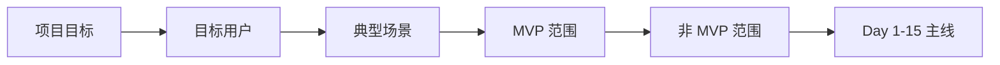

### 这一天的意义

Day 1 解决的不是“先写哪个接口”，而是：

> SentiFlow 前 15 天，到底只做什么，又明确不做什么。

如果这一天不把边界定死，后面很容易把多平台采集、图谱分析、复杂预警、湖仓架构提前塞进来，MVP 主线就会失焦。

---

## Day 2：梳理任务流与信息架构

### Day 2 做成了什么

- 明确 `dataset`、`analysis_task`、`analysis_result`、`report_export` 这几类核心对象
- 明确用户从导入文本到查看结果、导出报表的任务主链
- 明确页面和接口都应围绕任务对象组织，而不是各做各的

### Day 2 流程图

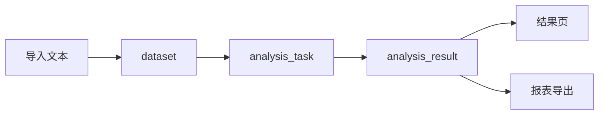

### 这一天的意义

Day 2 解决的是：

> 这个系统真正的中枢对象是什么，业务链路到底围绕什么流动。

从这一天开始，SentiFlow 不是“几个页面 + 几个接口”，而是一条以任务为中心的业务链。

---

## Day 3：建立 FastAPI 最小骨架

### Day 3 做成了什么

- 建立 `main.py`、`conf/`、`router/`、`shcemas/`、`services/`、`utils/` 的最小职责骨架
- 建立应用启动、配置加载、路由注册、统一响应结构
- 让导入、任务、结果查询这些核心入口有了稳定落点

### Day 3 流程图

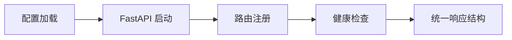

### 这一天的意义

Day 3 解决的是：

> Day 1 和 Day 2 讲清楚的业务主线，要挂在什么样的后端骨架上。

从这一天开始，SentiFlow 从规划文档进入真正可运行的后端阶段。

---

## Day 4：建立数据导入与任务创建入口

### Day 4 做成了什么

- 接入 CSV / JSON 这类 MVP 必需输入格式
- 让来源平台、时间范围、产品线等元信息有明确落点
- 把“导入一批文本”和“创建一个分析任务”拆成两个连续动作

### Day 4 流程图

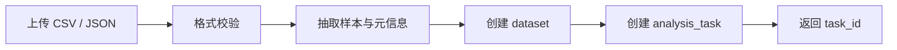

### 这一天的意义

Day 4 解决的是：

> 一批评论或舆情文本，怎样从外部输入变成系统内部可追踪的任务对象。

从这一天开始，系统第一次真正承接业务输入，而不再只是接口壳层。

---

## Day 5：文本预处理与标准化

### Day 5 做成了什么

- 对原始文本做去空、去噪、字段标准化和有效样本筛选
- 统一后续分析所消费的样本结构
- 为情感分析、关键词提取、主题归类和问题归因准备稳定输入

### Day 5 流程图

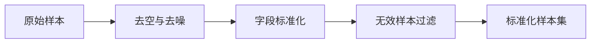

### 这一天的意义

Day 5 解决的是：

> 后续分析链不能直接吃原始噪声文本，必须先把输入质量收稳。

这一天让后面的分析结果开始有了可靠的数据基础。

---

## Day 6：情感分析主链跑通

### Day 6 做成了什么

- 开始对样本输出正向 / 中性 / 负向三类情感结果
- 建立样本级情感标签和任务级情感聚合结果
- 让系统第一次产生真正有业务感知价值的分析输出

### Day 6 流程图

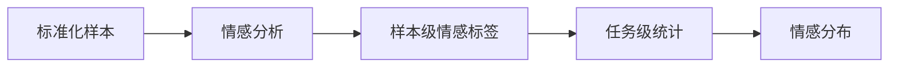

### 这一天的意义

Day 6 解决的是：

> SentiFlow 不再只是“能接文本”，而是开始“能给出情绪判断”。

这也是整个分析链第一块真正可展示的结果基础。

---

## Day 7：关键词提取与主题归类

### Day 7 做成了什么

- 提取高频词、热点词、风险词
- 对评论与舆情文本做主题归类或主题聚合
- 让结果从“有情感判断”进一步变成“有内容结构”

### Day 7 流程图

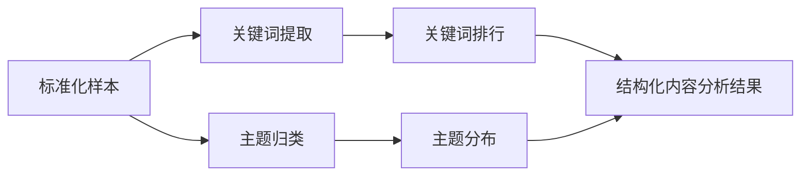

### 这一天的意义

Day 7 解决的是：

> 业务方不只想知道正负面，还要知道大家到底在讨论什么。

这一天让系统开始具备可解释性，而不是只输出情绪标签。

---

## Day 8：问题归因与代表样本整理

### Day 8 做成了什么

- 识别物流、质量、价格、服务、功能等问题类别
- 筛选负面样本和代表性评论
- 让分析结果从技术可用转向业务可读

### Day 8 流程图

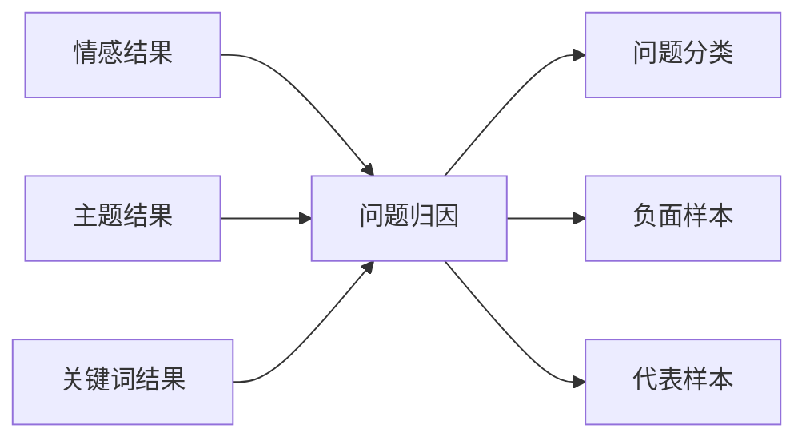

### 这一天的意义

Day 8 解决的是：

> 用户不仅要看标签，还要快速看懂问题在哪、哪些样本最值得人工关注。

这一天让 SentiFlow 的输出真正开始服务业务判断。

---

## Day 9：RabbitMQ 接管任务投递

### Day 9 做成了什么

- 把重分析任务从同步 HTTP 链路里移出来
- 让任务创建后先进入消息队列，而不是直接在请求里跑完整分析
- 为批量任务削峰和异步执行建立真正入口

### Day 9 流程图

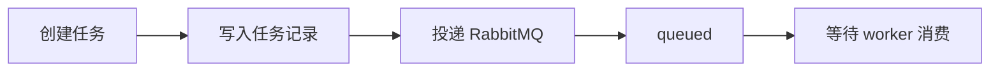

### 这一天的意义

Day 9 解决的是：

> 批量舆情分析不是一个适合同步跑完的 API 请求，它必须变成异步任务模型。

从这一天开始，系统正式从同步式接口转向异步任务后端。

---

## Day 10：Worker 接管分析执行

### Day 10 做成了什么

- 让队列中的任务由 worker 真正消费和执行
- 把预处理、情感、关键词、主题、归因这些主链搬进后台执行链路
- 建立成功、失败、日志和结果回写的统一执行出口

### Day 10 流程图

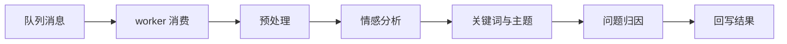

### 这一天的意义

Day 10 解决的是：

> 谁来真正跑这条分析链，谁来承担运行时执行壳层。

从这一天开始，API 层和分析执行正式分离。

---

## Day 11：Redis 状态与进度追踪成型

### Day 11 做成了什么

- 用 Redis 记录任务状态、阶段和进度
- 让任务执行过程不再是黑盒
- 为任务列表页和任务详情页提供实时可查询状态

### Day 11 流程图

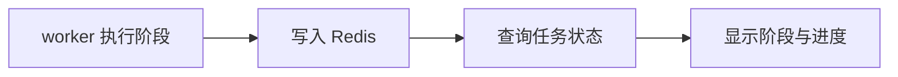

### 这一天的意义

Day 11 解决的是：

> 用户怎样知道任务有没有卡住、现在跑到哪一步、还能不能继续等。

这一天让系统开始具备真正的任务可观测性。

---

## Day 12：PostgreSQL 结果持久化与查询接口稳定

### Day 12 做成了什么

- 把任务元数据、分析结果摘要、执行状态等稳定写入 PostgreSQL
- 让结果查询不再依赖运行时缓存
- 让任务详情接口和结果查询接口有了稳定数据落点

### Day 12 流程图

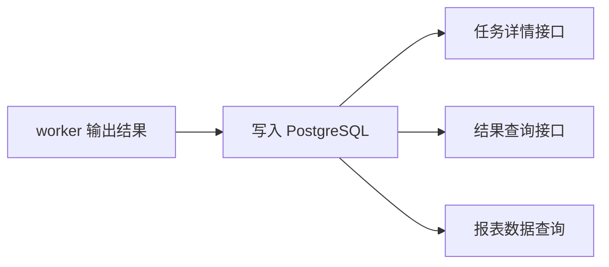

### 这一天的意义

Day 12 解决的是：

> 一次分析跑完以后，怎样把结果变成可反复查询、可供页面消费的业务事实。

从这一天开始，结果从“执行中的临时产物”变成“系统内稳定存在的数据”。

---

## Day 13：结果展示口径与基础报表模型收拢

### Day 13 做成了什么

- 收拢情感分布、主题占比、关键词排行、负面样本等展示口径
- 为结果页和报表页准备统一消费的数据模型
- 让前端图表和结果展示不再自行拼业务逻辑

### Day 13 流程图

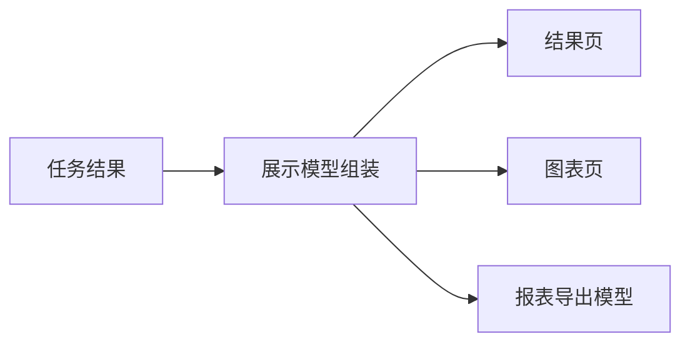

### 这一天的意义

Day 13 解决的是：

> 分析结果怎样稳定变成页面和报表真正可消费的数据源。

这一天让“结果存在”进一步升级成“结果可展示、可汇总、可导出”。

---

## Day 14：系统联调与基础导出闭环

### Day 14 做成了什么

- 把导入、任务创建、队列执行、状态查询、结果展示、导出真正串成一条链
- 打通基础报表导出能力
- 收拢异常提示、失败回溯和基础取消能力

### Day 14 流程图

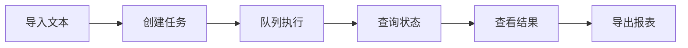

### 这一天的意义

Day 14 解决的是：

> 模块各自能跑，不等于整套系统真的形成闭环。

这一天的重点是联调和串联，验证主链上的每一段都能在真实流程里接上。

---

## Day 15：测试、监控、部署与验收收口

### Day 15 做成了什么

- 建立核心接口、任务链路、结果链路的基础测试
- 补齐部署说明、使用说明和验收清单
- 加入基础监控视角，让 MVP 从“开发中系统”变成“可交付版本”

### Day 15 流程图

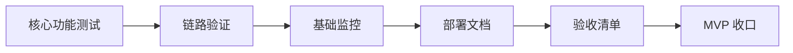

### 这一天的意义

Day 15 解决的是：

> 一个能跑一次的演示系统，不等于一个可以交付、复现、验收的版本。

从这一天开始，SentiFlow 的前 15 天工作才真正形成可验证的 MVP 成果。

---

## Day 1 - Day 15 串联总图

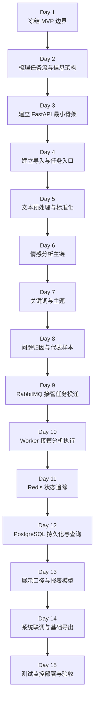

---

## 这 15 天到底是在搭什么

根据 `target` 文档里的总体计划，Day 1 - Day 15 可以压成 5 个阶段：

- 第 1 阶段：需求梳理与主线定界
  - Day 1
  - Day 2

- 第 2 阶段：数据接入与核心分析成形
  - Day 3
  - Day 4
  - Day 5
  - Day 6
  - Day 7
  - Day 8

- 第 3 阶段：异步调度与状态管理
  - Day 9
  - Day 10
  - Day 11
  - Day 12

- 第 4 阶段：结果展示与系统联调
  - Day 13
  - Day 14

- 第 5 阶段：测试优化与验收收口
  - Day 15

这 5 个阶段，对应的其实就是 `target` 里那条非常清楚的 MVP 交付路线：

```text
先把业务边界讲清楚
-> 再把输入和分析能力接起来
-> 再把执行模型改成异步任务化
-> 再把结果做成可展示、可导出的输出
-> 最后把系统收口成可交付版本
```

---

## 最终 MVP 系统总架构图

如果只看 Day 1 - Day 15 的主体，不把二期演进架构算进来，最后拼出来的是这样一套 MVP：

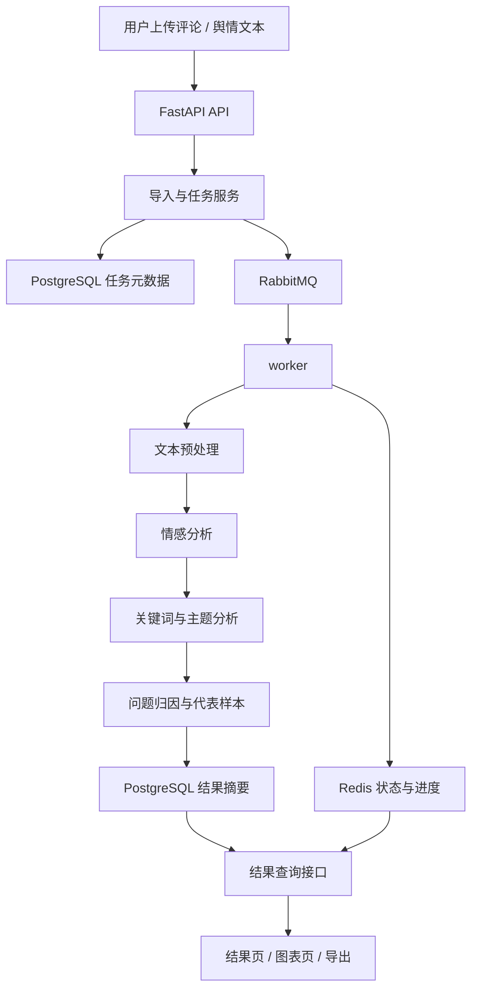

### 这张图要表达什么

Day 1 - Day 15 的终点，不是一个“上传文件后同步返回一段分析文本”的接口，而是一套面向批量评论和舆情文本分析的 MVP 后端：

- FastAPI 负责导入、建任务、查状态、查结果
- RabbitMQ 负责把重任务移出请求链路
- worker 负责执行完整分析链
- Redis 负责运行态状态和进度追踪
- PostgreSQL 负责任务事实、结果事实和查询事实
- 结果接口负责支撑页面、图表和导出

---

## 最小闭环全链路图

如果只记最关键的一条线，就记这一张：

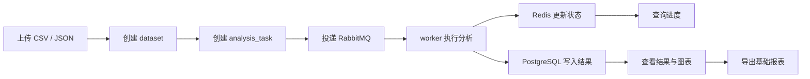

### 这一张图就是 Day 1 - Day 15 的灵魂

因为它把 `target` 文档里第一阶段真正要交付的价值压成了一条最短主线：

> 先把舆情和评论文本分析做成一个真正可跑通的异步任务闭环，再把结果稳定地变成可查询、可展示、可导出的 MVP 交付物。

