# Day 1 - Day 15 主体架构总览

这份文档只看两件事：

- Day 1 到 Day 15，每天到底把 SentiFlow 往前推进成了什么
- 这 15 天最后拼成了一套什么样的舆情分析 MVP 闭环

这一版刻意不展开数据库字段、具体 prompt、前端组件细节和后续增强路线，只保留 Day 1 到 Day 15 的主体架构和推进主线。

---

## 一句话总览

Day 1 到 Day 15，整个推进主线其实就是：

```text
把一个“舆情分析项目想法和目标文档”
-> 做成“可导入文本、可创建任务、可执行分析的后端骨架”
-> 做成“异步执行、状态可追踪、结果可查询的 MVP 闭环”
-> 做成“可展示、可导出、可测试、可验收的第一版系统”
```

---

## Day 1：冻结 MVP 边界与业务主线

### Day 1 做成了什么

- 明确项目聚焦的是企业舆情与评论批量分析，不做泛化 AI 平台
- 明确 MVP 只覆盖导入、分析、异步执行、结果展示、基础导出
- 明确第一阶段的核心用户、核心场景和交付边界

### Day 1 流程图

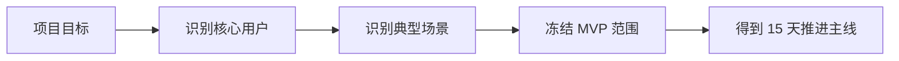

### 这一天的意义

Day 1 不是开始写接口，  
而是在先回答一个更根本的问题：

> SentiFlow 前 15 天到底要做成一个什么样的系统？

从这一天开始，项目目标从“想做很多能力”收敛成“先做成一个能跑通闭环的舆情分析 MVP”。

---

## Day 2：梳理任务流与信息架构

### Day 2 做成了什么

- 明确导入、任务、结果、报表四类核心对象
- 明确用户从上传文本到查看结果的完整任务链路
- 明确结果页、任务页、导出页依赖的数据关系

### Day 2 流程图

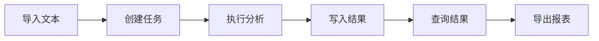

### 这一天的意义

Day 2 解决的是：

> 这个系统不是“若干个页面和接口的集合”，而是一条以任务为中心的业务链路。

如果这一天不讲清楚，后面接口、状态和结果结构都会各做各的。

---

## Day 3：建立 FastAPI 最小骨架

### Day 3 做成了什么

- 应用启动入口、配置加载、基础路由注册有了统一落点
- 健康检查接口和统一响应结构开始成型
- 项目从规划文档阶段进入可运行后端阶段

### Day 3 流程图

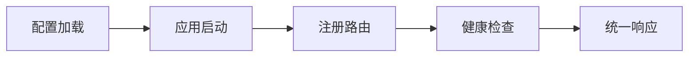

### 这一天的意义

Day 3 解决的是：

> 后面的数据导入、任务创建和结果查询，到底要挂在什么样的后端骨架上？

从这一天开始，SentiFlow 不再只是项目计划，而是有了真正的 API 入口。

---

## Day 4：建立数据导入与任务创建入口

### Day 4 做成了什么

- 支持 CSV/JSON 批量文本导入
- 为任务附加来源平台、时间范围、产品线等元信息
- 导入动作和任务创建动作开始分离

### Day 4 流程图

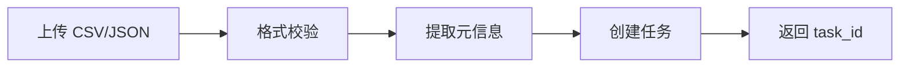

### 这一天的意义

Day 4 解决的是：

> 用户交给系统的一批评论或舆情文本，怎样才能变成一个可追踪的分析任务？

从这一天开始，任务成了整个系统的中心载体。

---

## Day 5：文本预处理与标准化

### Day 5 做成了什么

- 原始文本开始经过清洗、去噪、去空和字段标准化
- 系统能区分有效样本和无效样本
- 后续分析模块开始基于统一输入工作

### Day 5 流程图

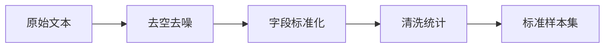

### 这一天的意义

Day 5 解决的是：

> 分析模块不能直接吃原始噪声数据，必须先把输入质量做稳。

这一天让后面的情感、主题和归因结果有了稳定的数据基础。

---

## Day 6：情感分析主链跑通

### Day 6 做成了什么

- 系统开始输出正向、中性、负向三类情感结果
- 情感分析结果开始结构化，而不是只返回一段模型自然语言
- 任务级别可以聚合情感分布

### Day 6 流程图

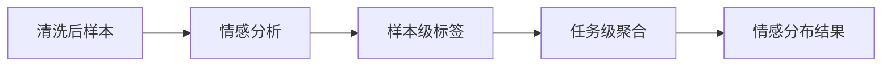

### 这一天的意义

Day 6 解决的是：

> 系统终于开始对用户文本输出第一类真正有感知价值的分析结果。

从这一天开始，SentiFlow 不再只是“能接收文本”，而是“能产出情绪判断”。

---

## Day 7：关键词提取与主题归类

### Day 7 做成了什么

- 系统开始识别高频关键词
- 系统开始按主题对评论和舆情内容做归类
- 结果从“有情感”进一步变成“有内容结构”

### Day 7 流程图

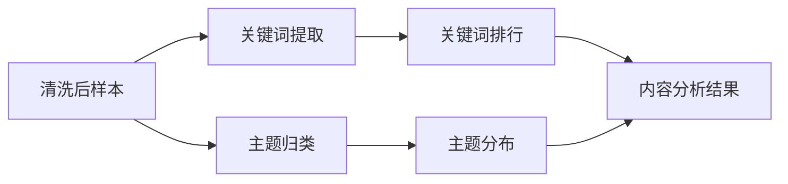

### 这一天的意义

Day 7 解决的是：

> 光知道正负面还不够，业务方还要知道大家到底在讨论什么。

这一天让结果开始具备可解释性，而不只是标签化输出。

---

## Day 8：问题归因与代表样本整理

### Day 8 做成了什么

- 系统开始把问题归因为物流、质量、价格、服务、功能等类别
- 系统开始筛选负面样本和代表性评论
- 分析结果开始能支撑业务人员快速读懂问题

### Day 8 流程图

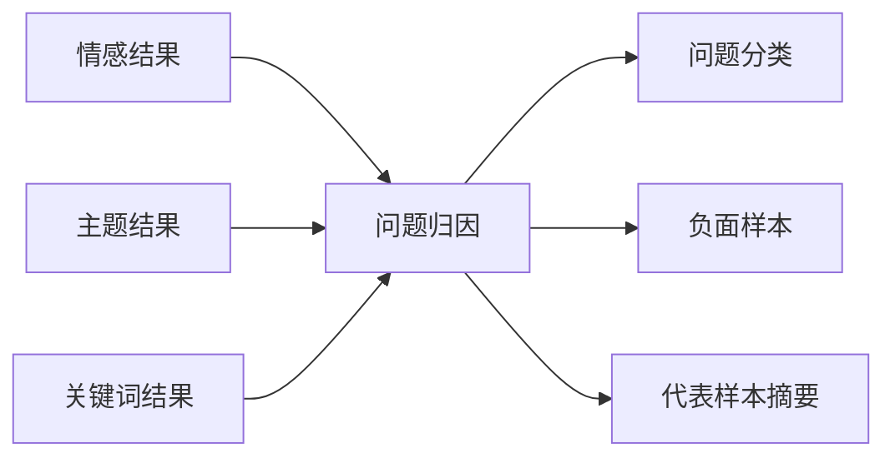

### 这一天的意义

Day 8 解决的是：

> 用户不是只想看分类结果，而是想知道问题到底出在哪、哪些样本最值得看。

从这一天开始，结果从技术可用转向业务可读。

---

## Day 9：RabbitMQ 接管任务投递

### Day 9 做成了什么

- 任务创建后不再同步执行完整分析链
- API 层只负责创建任务并把任务投递到队列
- 任务状态开始从 `pending` 进入 `queued`

### Day 9 流程图

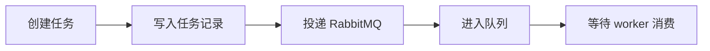

### 这一天的意义

Day 9 解决的是：

> 批量文本分析这种重任务，不应该继续压在 HTTP 请求链路里。

从这一天开始，SentiFlow 从同步式接口开始转向异步式任务后端。

---

## Day 10：Worker 接管分析执行

### Day 10 做成了什么

- 队列中的任务开始由 worker 真正执行
- 预处理、情感分析、关键词、主题、归因开始进入后台链路
- 成功、失败和执行日志有了统一回写点

### Day 10 流程图

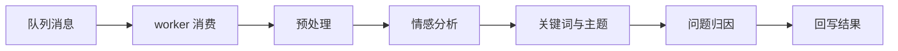

### 这一天的意义

Day 10 解决的是：

> 谁来真正跑这条分析链路，谁来承担运行时执行壳层？

从这一天开始，API 和分析执行正式分离。

---

## Day 11：Redis 状态与进度追踪成型

### Day 11 做成了什么

- 任务执行状态开始实时写入 Redis
- 前端或查询接口能看到当前阶段和进度百分比
- 任务执行不再是黑盒

### Day 11 流程图

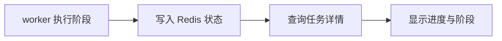

### 这一天的意义

Day 11 解决的是：

> 批量分析任务执行过程中，用户怎样知道系统没有卡住、跑到了哪一步？

这一天让系统开始具备真正的可观测性和任务体验。

---

## Day 12：结果持久化与查询接口稳定

### Day 12 做成了什么

- 任务结果开始稳定写入持久层
- 任务详情接口和结果查询接口开始成型
- 结果查询不再依赖运行时缓存

### Day 12 流程图

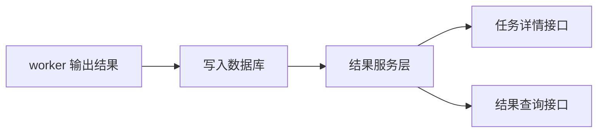

### 这一天的意义

Day 12 解决的是：

> 一次分析跑完以后，怎样把结果真正变成可反复查询、可供页面消费的业务事实？

从这一天开始，结果开始脱离临时执行过程，成为系统稳定数据的一部分。

---

## Day 13：结果展示口径与报表数据模型收拢

### Day 13 做成了什么

- 情感分布、主题占比、关键词排行、负面样本等展示数据开始统一口径
- 结果页和报表页有了可直接消费的 view model
- 前端不再需要自行拼复杂业务逻辑

### Day 13 流程图

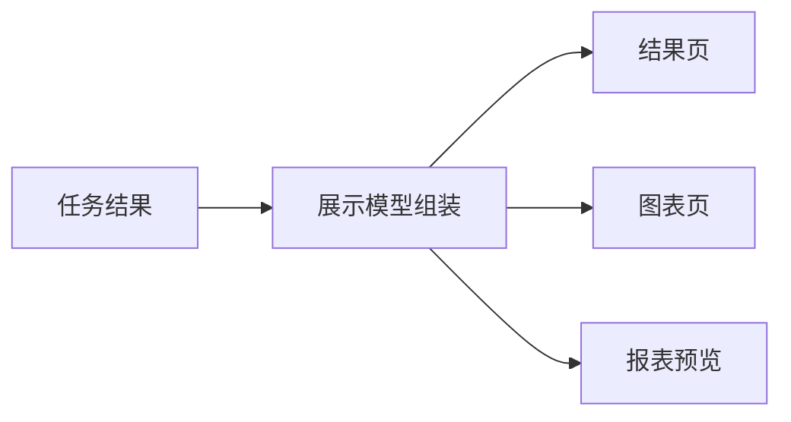

### 这一天的意义

Day 13 解决的是：

> 分析结果怎样才能稳定地变成页面、图表和报表的数据来源，而不是一堆散装字段？

这一天让“结果存在”进一步变成“结果可展示”。

---

## Day 14：系统联调与基础导出闭环

### Day 14 做成了什么

- 导入、任务创建、队列执行、结果查询、展示输出开始被真正串成一条链
- 基础导出能力开始打通
- 常见异常提示、失败回溯和取消预留开始成型

### Day 14 流程图

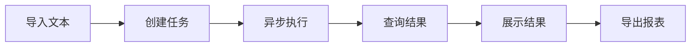

### 这一天的意义

Day 14 解决的是：

> 前面各模块各自能跑，不代表整套系统真的已经形成闭环。

这一天的重点是把所有模块接起来，验证它们在真实链路里是否一致。

---

## Day 15：测试、监控、部署与验收收口

### Day 15 做成了什么

- 核心接口、任务链路和结果链路开始有测试覆盖
- 基础监控项、部署说明和验收清单开始补齐
- MVP 从“开发中系统”变成“可验证交付物”

### Day 15 流程图

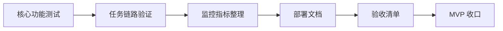

### 这一天的意义

Day 15 解决的是：

> 一个能演示一次的系统，不等于一个能交付、能复现、能验收的系统。

从这一天开始，SentiFlow 的前 15 天工作才真正形成完整的 MVP 交付闭环。

---

## Day 1 - Day 15 串联总图

这一张图最重要。  
后面复盘时，优先看这张。

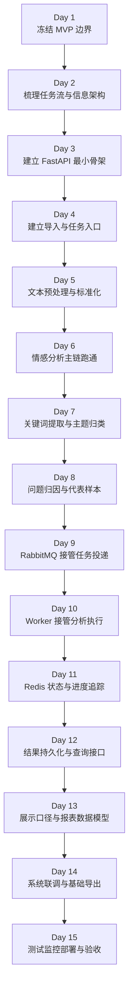

### 这 15 天到底是在搭什么

你可以把它理解成 5 个阶段：

- 第 1 阶段：把项目边界和任务主线讲清楚
  - Day 1
  - Day 2

- 第 2 阶段：把后端骨架和分析能力立起来
  - Day 3
  - Day 4
  - Day 5
  - Day 6
  - Day 7
  - Day 8

- 第 3 阶段：把执行模型改成异步任务化
  - Day 9
  - Day 10
  - Day 11
  - Day 12

- 第 4 阶段：把结果真正变成可展示、可导出的业务输出
  - Day 13
  - Day 14

- 第 5 阶段：把 MVP 收口成可测试、可部署、可验收版本
  - Day 15

---

## 最终系统总架构图

如果只看主体架构，不看具体实现细节，  
Day 1 到 Day 15 最后拼出来的是这样一个系统：

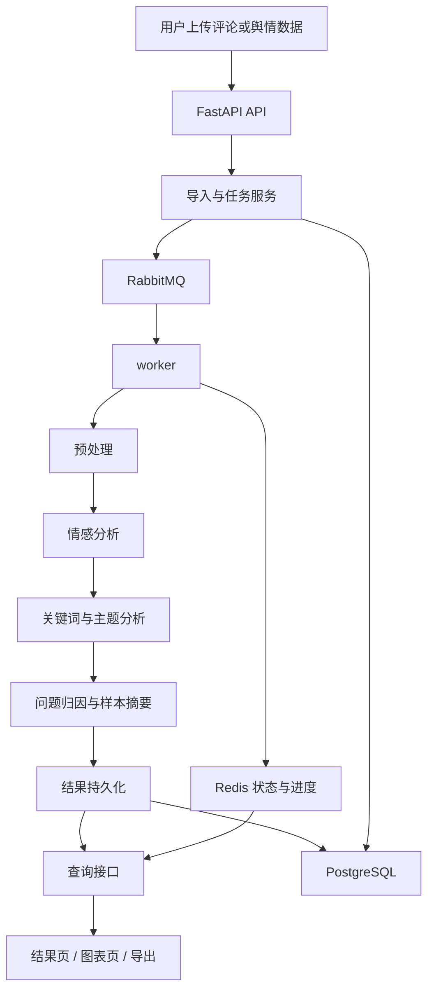

### 这张图要表达什么

最终做出来的，不是一个“上传文件后同步跑完再返回”的接口，  
而是一套面向批量评论和舆情文本分析的 MVP 后端：

- API 层负责接收导入请求、创建任务、查询结果
- RabbitMQ 负责把重任务移出请求链路
- worker 负责执行完整分析链
- Redis 负责状态、进度和运行态追踪
- PostgreSQL 负责任务事实、结果事实和可查询数据
- 结果接口负责支撑页面、图表和导出

---

## 最小闭环全链路图

如果只记最关键的一条线，就记这一张：

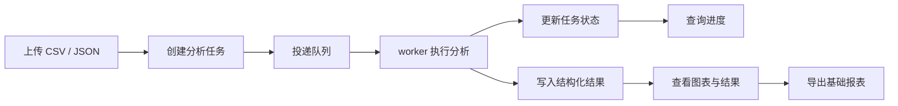

### 这一张图就是整个 Day 1 - Day 15 的灵魂

因为它把这 15 天最核心的价值浓缩成了一条线：

> 先把舆情和评论文本分析做成一个真正可跑通的异步任务闭环，再把结果稳定地变成可查询、可展示、可导出的 MVP 交付物。
