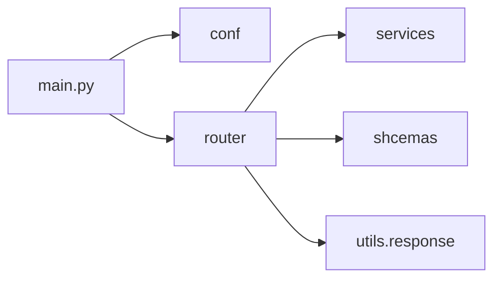

# Day 3：建立 FastAPI 最小骨架

## 今天的总目标

- 把 Day 1 和 Day 2 的规划，真正落成一个可运行的 FastAPI 最小骨架
- 先建立应用入口、配置加载、路由注册和统一响应结构
- 让导入、任务、结果这些核心入口有稳定落点
- 为 Day 4 之后的数据导入与分析链路提供一套不乱的后端底座

## 今天结束前，你必须拿到什么

- 一个可启动的 FastAPI 应用入口
- 一套最小目录职责定义
- 一个健康检查接口
- 一组统一响应结构
- 一版可以继续接导入和任务接口的 router / schema / service 骨架

---

## 今天开始，先不要急着写完整分析逻辑

Day 3 最容易犯的错误就是：

- 一立好 FastAPI 就马上把导入、分析、队列、结果接口全写满
- 一想到任务流就马上把 RabbitMQ 和 Redis 全接进去
- 一看到现在仓库已经有一些目录，就不再定义清楚职责边界

这些都不是 Day 3 的重点。

今天真正要解决的是：

> SentiFlow 的 MVP 主链路，应该先挂在什么样的后端骨架上？

如果这个问题没处理好，  
后面会出现两个典型坏结果：

- 路由层越来越厚，业务逻辑到处乱放
- schema、service、utils 各写一份临时逻辑，后面难收

所以 Day 3 的关键词不是“把功能写多”，而是：

```text
入口
骨架
职责
统一返回
```

---

## 第 1 层：Day 3 的本质是什么

Day 1 定的是：

```text
边界
```

Day 2 定的是：

```text
任务流和信息架构
```

Day 3 定的是：

```text
后端应用骨架
```

也就是说，Day 3 不是开始“做完整系统”，  
而是开始让前两天已经讲清楚的东西，有地方可以稳定落下去。

---

## 第 2 层：Day 3 最小骨架应该长什么样

结合当前仓库已有目录，Day 3 最稳的做法不是大改命名，  
而是先按现在的实际目录做最小职责收敛：

```text
main.py
conf/
router/
shcemas/
services/
utils/
steps/
target/
```

### 当前阶段每层先负责什么

#### `main.py`

负责：

- 创建 FastAPI 应用
- 注册路由
- 注册启动配置

#### `conf/`

负责：

- 环境配置
- 日志配置
- 基础常量

#### `router/`

负责：

- HTTP 请求入口
- 参数接收
- 调用 service
- 返回统一响应

#### `shcemas/`

负责：

- 请求模型
- 响应模型
- 边界数据结构

#### `services/`

负责：

- 任务创建
- 导入预处理入口
- 结果查询入口

#### `utils/`

负责：

- 通用响应包装
- 通用异常
- 少量纯辅助函数

Day 3 先把这层意思讲清楚，比一次性扩很多目录更重要。

---

## 第 3 层：为什么 Day 3 不急着做完整分层

当前仓库里已经有：

- `crud/`
- `models/`
- `pipelines/`

这些目录后面当然会用到。  
但 Day 3 最稳的做法，是先建立最小应用骨架，不要今天把所有层都做满。

原因很简单：

- 导入接口还没真正落
- 任务接口还没真正落
- 分析链还没真正接

今天如果把过多抽象提前做满，  
很容易出现“目录很多，但真正主链还没开始稳定”的问题。

Day 3 先立住：

```text
应用入口
-> 配置
-> 路由
-> schema
-> service
-> 统一响应
```

这条线就够了。

---

## 第 4 层：Day 3 先立哪些最小接口

今天不用把所有接口做完。  
最小骨架建议先支撑这些：

- `GET /health`
- `POST /tasks/import`
- `POST /tasks`
- `GET /tasks/{task_id}`
- `GET /tasks/{task_id}/results`

### 为什么先是这几个

因为它们正好对齐 Day 2 的主链：

```text
导入
-> 创建任务
-> 看状态
-> 看结果
```

如果这几个入口都有稳定落点，  
后面 Day 4 以后再接异步执行、进度、导出，都会顺很多。

---

## 第 5 层：今天必须先把统一响应结构定住

Day 3 很多项目都会忽略这一点。  
结果就是后面接口返回形状越来越乱。

今天建议先定最小统一结构：

```json
{
  "code": 0,
  "message": "success",
  "data": {}
}
```

### 为什么今天就要定

因为后面会逐渐出现：

- 导入结果
- 任务创建结果
- 任务详情结果
- 任务结果详情
- 错误返回

如果现在不统一，  
后面 router 会越来越难收。

---

## 第 6 层：Day 3 的健康检查为什么值得先做

很多人会觉得：

```text
/health 太简单了，没必要专门做
```

这是错的。

`/health` 的价值不是业务复杂度，  
而是它能证明：

- 应用能启动
- 路由能注册
- 响应结构能统一
- 配置加载没有明显问题

Day 3 先把 `/health` 打通，  
后面接其他接口会稳很多。

---

## 第 7 层：Day 3 先把哪些 schema 定出来

今天最稳的 schema 最小集合只要这些：

- `CommonResponse`
- `HealthResponse`
- `TaskImportRequest` / `TaskImportPreview`
- `TaskCreateRequest` / `TaskCreateResponse`
- `TaskDetailResponse`
- `TaskResultResponse`

### 为什么先是这组

因为这组 schema 已经足够覆盖：

- 健康检查
- 导入入口
- 任务创建
- 任务查询
- 结果查询

Day 3 不需要把所有分析字段展开到极细。

---

## 第 8 层：Day 3 不建议做什么

今天不建议做：

- 不急着接 RabbitMQ
- 不急着接 Redis
- 不急着实现真正的情感分析
- 不急着把关键词、主题、归因都接进 API
- 不急着写复杂 ORM 逻辑
- 不急着做完整导出能力

今天只做一件事：

> 把 SentiFlow 的最小 API 骨架立起来，让主链路有稳定落点。

---

## 上午学习：09:00 - 12:00

## 09:00 - 09:50：把 Day 3 的主问题讲顺

### 今天你要能顺着说出来

```text
Day 1 定边界
-> Day 2 定任务流
-> Day 3 不再谈抽象目标
-> Day 3 要把这些目标落成可运行的 FastAPI 骨架
-> 先立应用入口、配置、路由、schema、service、统一响应
-> Day 4 再继续接具体导入和任务逻辑
```

### 你必须能回答这两个问题

1. 为什么 Day 3 不应该一上来就把所有业务逻辑写满？
2. 为什么 `/health` 和统一响应结构值得先做？

---

## 09:50 - 10:40：先画 Day 3 的最小后端结构图



这张图要表达的是：

> Day 3 先把入口和职责顺起来，而不是把所有功能填满。

---

## 10:40 - 11:30：整理最小目录职责表

### `steps/day3_directory_map.md` 练手骨架版

````markdown
# Day 3 目录职责表

| 目录或文件 | 当前职责 |
|---|---|
| TODO | TODO |
````

### `steps/day3_directory_map.md` 参考答案

````markdown
# Day 3 目录职责表

| 目录或文件 | 当前职责 |
|---|---|
| `main.py` | 应用启动与路由注册 |
| `conf/` | 配置与日志 |
| `router/` | HTTP 请求入口 |
| `shcemas/` | 请求和响应模型 |
| `services/` | 业务入口与任务入口 |
| `utils/` | 通用响应与异常 |
````

---

## 11:30 - 12:00：先决定今天怎么验收

### Day 3 最直接的验收方式

今天至少要能回答：

1. 应用能不能启动？
2. `/health` 能不能返回统一结构？
3. router、schema、service 的职责能不能各用一句话讲清楚？
4. 后续导入和任务接口有没有稳定落点？

---

## 下午编码：14:00 - 18:00

## 14:00 - 14:40：先搭 `main.py` 和 `/health`

### `main.py` 练手骨架版

```python
from fastapi import FastAPI


def create_app() -> FastAPI:
    app = FastAPI(title="SentiFlow")

    # 你要做的事：
    # 1. 注册 health router
    # 2. 后续预留 tasks router
    return app


app = create_app()
```

### `main.py` 参考答案

```python
from fastapi import FastAPI

from router.health import router as health_router


def create_app() -> FastAPI:
    app = FastAPI(title="SentiFlow")
    app.include_router(health_router, prefix="")
    return app


app = create_app()
```

### `router/health.py` 参考答案

```python
from fastapi import APIRouter

from utils.response import success_response

router = APIRouter(tags=["health"])


@router.get("/health")
async def health_check():
    return success_response(
        data={"status": "ok"},
        message="service healthy",
    )
```

---

## 14:40 - 15:30：先补统一响应结构

### `utils/response.py` 练手骨架版

```python
def success_response(data=None, message="success"):
    # 你要做的事：
    # 1. 返回统一 code/message/data 结构
    raise NotImplementedError
```

### `utils/response.py` 参考答案

```python
def success_response(data=None, message="success"):
    return {
        "code": 0,
        "message": message,
        "data": data,
    }


def error_response(message="error", code=1, data=None):
    return {
        "code": code,
        "message": message,
        "data": data,
    }
```

### 为什么这一步值得今天就做

因为后面所有接口都会受益。  
这不是“装饰性代码”，而是收住接口口径的第一步。

---

## 15:30 - 16:20：先补最小 schema

### `shcemas/common.py` 练手骨架版

```python
from pydantic import BaseModel


class CommonResponse(BaseModel):
    # 你要做的事：
    # 1. 定义 code
    # 2. 定义 message
    # 3. 定义 data
    raise NotImplementedError
```

### `shcemas/common.py` 参考答案

```python
from typing import Any

from pydantic import BaseModel, Field


class CommonResponse(BaseModel):
    code: int = Field(default=0)
    message: str = Field(default="success")
    data: Any = None
```

### 这里要先理解的点

Day 3 的 schema 不是为了“类型更全”，  
而是为了把后续接口边界先收住。

---

## 16:20 - 17:10：给 tasks 相关接口留出骨架

今天先不追求完整实现。  
但建议把入口先留出来：

- `router/tasks.py`
- `shcemas/task_schema.py`
- `services/task_service.py`

### `router/tasks.py` 练手骨架版

```python
from fastapi import APIRouter

router = APIRouter(prefix="/tasks", tags=["tasks"])


@router.post("/import")
async def import_task_data():
    raise NotImplementedError


@router.post("")
async def create_task():
    raise NotImplementedError


@router.get("/{task_id}")
async def get_task_detail(task_id: str):
    raise NotImplementedError
```

### 为什么 Day 3 可以先留骨架

因为今天的重点是：

- 入口已经有位置
- 职责已经有归属

真正导入逻辑和任务逻辑，  
后面几天再逐步接入。

---

## 17:10 - 18:00：整理 Day 4 的输入

Day 4 往后会开始继续接：

- 导入逻辑
- 任务创建逻辑
- 文本预处理逻辑

所以 Day 3 结束前，你至少要准备好：

- 应用已经能启动
- router 已经有稳定位置
- schema 已经有稳定位置
- service 已经有稳定位置
- 统一响应结构已经成型

这样 Day 4 往后就不会再反复改后端底座。

---

## 晚上复盘：20:00 - 21:00

### 今晚你必须自己讲顺的 8 个点

1. Day 3 的本质为什么是“立骨架”，不是“写满功能”？
2. 为什么 `main.py`、`conf/`、`router/`、`shcemas/`、`services/`、`utils/` 这几个位置要先定住？
3. 为什么 `/health` 值得先做？
4. 为什么统一响应结构今天就要定？
5. 为什么 Day 3 不急着把 RabbitMQ 和 Redis 接进来？
6. 为什么 tasks 相关 router 可以先放骨架？
7. 为什么 schema 的价值在于收住边界，而不是一次定义得特别全？
8. Day 4 往后真正的业务逻辑要接在哪些位置？

---

## 今日验收标准

- 应用可以启动
- `/health` 可以返回统一结构
- `main.py`、`conf/`、`router/`、`shcemas/`、`services/`、`utils/` 的职责可以讲清楚
- tasks 相关入口已经有稳定落点
- 统一响应结构已经有最小版本
- Day 4 往后的导入和任务逻辑已经有骨架位置可接

---

## 今天最容易踩的坑

### 坑 1：Day 3 就想把所有接口和逻辑写满

问题：

- 功能看起来很多
- 但骨架反而不稳

规避建议：

- 先立入口和职责，再逐步接业务

### 坑 2：router 里开始堆业务逻辑

问题：

- 路由层越来越厚
- 后面 service 无法稳定承接

规避建议：

- router 只做参数接收、调用 service、返回统一响应

### 坑 3：统一响应结构今天不做

问题：

- 后面每个接口返回格式可能都不一样

规避建议：

- Day 3 就先统一 code/message/data

### 坑 4：目录很多，但职责不清楚

问题：

- 看起来像分层了
- 实际只是换了文件夹

规避建议：

- 每个目录先只用一句话定义职责

---
## 给明天的交接提示

明天开始，后面的几天就不再只是“谈结构”，  
而是要沿着 Day 3 立好的骨架，继续把这些主线真正接起来：

```text
导入文本
-> 创建任务
-> 预处理
-> 分析
-> 查结果
```

所以 Day 3 最关键的交接只有一句话：

```text
先把 SentiFlow 的 FastAPI 最小骨架立稳，后面的导入、任务和分析能力才有地方稳定落下去。
```
