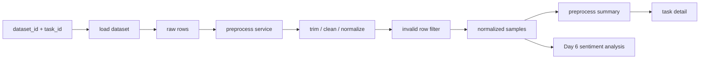
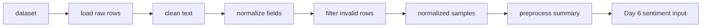

# Day 5：建立文本预处理与标准化主链

## 今天的总目标

- 把 Day 4 已经接进系统的 `dataset + task`，真正推进成一套可复用的文本预处理主链
- 让 CSV / JSON / MarkItDown adapter 进来的样本，都能进入同一种标准化流程
- 建立去空、去噪、字段标准化、无效样本过滤这几个最小预处理步骤
- 让 Day 6 的情感分析不再直接面对原始输入，而是面对统一的标准样本
- 明确“导入”已经结束，“预处理”现在开始独立承担输入质量控制

## 今天结束前，你必须拿到什么

- 一条真正清楚的 `dataset -> preprocess -> normalized samples` 主链
- 一套 Day 5 最小预处理 schema
- 一套 Day 5 最小预处理 service 设计
- 一份能讲清楚“为什么预处理不能继续塞在导入接口里”的判断标准
- 一份可以直接交给 Day 6 情感分析继续消费的标准样本契约
- 一份当前仓库里 Day 5 应该新增哪些文件、哪些文件只做小改的落点说明

---

## Day 5 一图总览

一句话总结：

> Day 5 不是开始做更复杂的分析，而是把 Day 4 收进来的原始样本，整理成后续分析真正能稳定消费的标准输入。

主链路先压缩成这一条：

```text
dataset
-> load raw rows
-> preprocess pipeline
-> clean / normalize / filter
-> normalized samples
-> write back preprocess summary
-> Day 6 情感分析
```

今天最不能混淆的 5 件事：

- `import` 负责把文件和文本收进系统
- `preprocess` 负责把原始样本变成标准样本
- `normalized sample` 必须和文件来源解耦
- Day 5 的终点是“输入质量收稳”，不是“分析结果产出”
- Day 6 接的是标准样本，不再接原始导入动作

---

## 为什么这一天重要

很多人会误以为 Day 5 只是：

- 多写几条字符串清洗规则
- 顺手把空文本过滤掉
- 给 Day 4 的导入接口补一点后处理

这都不够准确。

Day 5 真正重要的地方在于：

> 从今天开始，SentiFlow 才第一次把“能被读出来的文本”变成“能被分析链稳定消费的文本”。

如果没有这一步，后面的：

- 情感分析
- 关键词提取
- 主题归类
- 问题归因
- 负面样本筛选

都会直接暴露在脏输入、空输入、字段不齐、格式不一致这些问题面前。

所以 Day 5 不是“补一点清洗逻辑的一天”，  
而是系统第一次建立输入质量控制层的一天。

---

## Day 5 整体架构



再压缩成仓库里真正的文件落点：

```text
router/tasks.py
-> services/preprocess_service.py
-> shcemas/preprocess_schema.py
-> crud/dataset_crud.py
-> models/dataset_model.py
-> utils/text_cleaner.py
-> Day 6 再接情感分析 service
```

---

## 今天的边界要讲透

Day 5 解决的是：

```text
怎样从 dataset 中取出原始样本
怎样统一做文本清洗和字段整理
怎样筛掉无效样本
怎样沉淀成统一 normalized samples
怎样给 Day 6 提供稳定输入契约
```

Day 5 不解决的是：

```text
情感分析怎样算
关键词怎样抽
主题怎样聚
问题归因怎样做
队列调度怎样接
结果展示怎样出图
```

### 今天之后，各层职责应该怎么理解

| 位置 | Day 5 负责什么 | Day 5 不负责什么 |
| --- | --- | --- |
| `router/tasks.py` | 提供触发预处理或查看预处理结果的 HTTP 入口 | 写清洗规则细节 |
| `services/preprocess_service.py` | 编排预处理主链、组装标准样本和预处理摘要 | 直接写 SQL 和持久层细节 |
| `shcemas/preprocess_schema.py` | 定义原始样本、标准样本、预处理摘要边界模型 | 持有业务流程 |
| `crud/dataset_crud.py` | 提供 dataset 查询与预处理结果回写 | 持有清洗规则 |
| `models/dataset_model.py` | 为预处理摘要和标准化结果预留持久字段 | 做业务判断 |
| `utils/text_cleaner.py` | 只放小而纯的文本清洗辅助函数 | 承担整条预处理编排 |
| `pipelines/` | 今天仍然可以先不启用 | 今天不承接 Day 5 主线 |

### 对当前仓库的处理原则

Day 5 对现有目录先做三类判断：

| 分类 | 目录 / 文件 | 处理方式 |
| --- | --- | --- |
| 直接复用 | `router/tasks.py` `services/task_service.py` `crud/dataset_crud.py` | 接上 dataset 查询与 Day 5 入口 |
| 小改接入 | `models/dataset_model.py` `shcemas/` | 新增预处理字段和预处理专属 schema |
| 新增文件 | `services/preprocess_service.py` `shcemas/preprocess_schema.py` `utils/text_cleaner.py` | 作为 Day 5 主线落点 |

这个判断很重要。  
它能防止 Day 5 一上来就为了“分层完整”做大重构，结果真正的预处理主链反而没先立住。

---

## 今天开始，先不要急着写情感分析

Day 5 最容易犯的错误就是：

- 一看到“标准样本”就马上顺手把情感分析接进去
- 一看到清洗逻辑就直接塞回 `services/task_service.py`
- 一看到样本字段，就开始为 Day 7、Day 8 预留太多复杂分析字段
- 一看到当前仓库里还没有 `preprocess_service.py`，就想顺手把 `pipelines/`、`tasks/`、`results/` 一起补全

这些都不是 Day 5 的重点。

今天真正要解决的是：

> Day 4 收进来的原始文本，怎样才能先变成一份统一、稳定、可复用的分析输入。

如果这个问题没讲清楚，  
后面会出现两个典型坏结果：

- 各个分析模块都各自清洗一遍，规则分散，口径不一
- 情感、关键词、主题都直接面对原始样本，后面问题越来越难排查

所以 Day 5 的关键词不是“开始出结果”，而是：

```text
预处理
输入质量
统一样本
清洗
标准化
过滤
摘要
```

---

## 第 1 层：Day 5 的本质是什么

Day 1 定的是：

```text
边界
```

Day 2 定的是：

```text
任务流和信息架构
```

Day 3 定的是：

```text
后端应用骨架
```

Day 4 定的是：

```text
输入进入系统并挂到任务上
```

Day 5 定的是：

```text
任务输入怎样变成统一分析输入
```

也就是说，Day 5 不是继续扩大导入能力，  
而是开始回答另一个非常具体的问题：

```text
同样是一批被导入进来的文本
-> 怎样去掉脏数据
-> 怎样统一字段
-> 怎样形成后续分析都能认的输入格式
```

这一步一旦走通，  
SentiFlow 后面的分析层就不需要再反复关心“这条样本原来来自 CSV 还是 PDF”。

---

## 第 2 层：Day 5 的主链一定要从 dataset 出发

今天你要先把 Day 5 的主链牢牢记成这样：

```text
dataset
-> 读取原始样本
-> 做去空 / 去噪 / 文本规整
-> 做字段标准化
-> 过滤无效样本
-> 生成 normalized samples
-> 输出 preprocess summary
```

这里最重要的不是步骤名字，  
而是你要看清楚：

- Day 5 接的是 `dataset`
- 不是重新接文件上传
- 不是重新解析任务创建
- 不是直接跳进情感分析

### 为什么一定要从 dataset 出发

因为 Day 4 已经做成了这条边界：

```text
文件输入
-> dataset
-> task
```

那么 Day 5 最稳的接法就应该是：

```text
dataset
-> preprocess
-> normalized samples
```

而不是：

```text
重新读上传文件
-> 在导入接口里顺手清洗
-> 顺手进分析
```

后者会把 Day 4 和 Day 5 的边界重新打乱。

---

## 第 3 层：为什么 Day 5 一定要把预处理独立出来

很多人会本能地写成这样：

```text
导入时直接顺手做清洗
-> 顺手做标准化
-> 顺手做分析
```

这看起来省事，  
但会把后面所有分析模块都拖进输入质量泥潭里。

### 问题 1：导入职责会越来越重

如果导入同时负责：

- 文件解析
- 字段清洗
- 无效样本判定
- 文本标准化
- 甚至分析前准备

那么 Day 4 的导入层就会变成一个越来越厚的黑盒。

### 问题 2：后续分析很难复用同一套输入口径

Day 6 会做情感分析。  
Day 7 会做关键词和主题。  
Day 8 会做问题归因和代表样本。

如果没有 Day 5 先统一输入，  
这些模块迟早会各自写一套“自己的清洗规则”。

### 问题 3：数据问题很难定位

一旦后面结果异常，你很难判断是：

- 导入解析出了问题
- 预处理规则出了问题
- 还是分析模块本身出了问题

所以 Day 5 的核心边界要反复记：

```text
导入负责把文本收进系统
预处理负责把文本整理成分析输入
分析模块负责在标准输入上产出业务结果
```

---

## 第 4 层：Day 5 先把标准样本契约讲清楚

今天最值得先定住的，不是某一条清洗规则，  
而是 Day 5 产出的 `normalized sample` 到底长什么样。

### 原始样本和标准样本不是一回事

Day 4 给进来的样本更接近：

```text
content
published_at
extra
```

Day 5 之后，至少应该统一成这种更稳定的结构：

```text
sample_id
content_raw
content_clean
source_platform
published_at
language
is_valid
invalid_reason
extra
```

### 为什么值得今天先加 `content_raw` 和 `content_clean`

因为后面你会越来越需要区分：

- 原始文本是什么
- 清洗后的文本是什么

这对排查问题、复盘规则、校验分析结果都很重要。

### 为什么值得先保留 `is_valid` 和 `invalid_reason`

Day 5 不是只有“保留下来的样本”，  
它还应该能解释：

- 哪些样本被过滤了
- 为什么被过滤

否则后面看到样本数变少，你只知道“少了”，不知道“为什么少”。

### Day 5 不要过早做什么

今天不需要把标准样本扩成非常复杂的 NLP 中间层。  
比如这些内容先不用放进 Day 5 契约：

- token 明细
- embedding 向量
- topic 候选列表
- sentiment score
- graph relation

Day 5 的目标是统一输入，  
不是提前承载 Day 6 以后全部分析输出。

---

## 第 5 层：Day 5 最小预处理步骤应该先有哪些

Day 5 最稳的做法，不是一次写一大堆复杂规则。  
而是先把最小、最有价值、最通用的步骤立住。

### 步骤 1：去空

至少要处理：

- 空字符串
- 只有空格或换行的文本
- 转换后没有真正内容的 Markdown / 文本

### 步骤 2：去噪

至少要处理：

- 首尾空白
- 重复换行
- 明显无意义占位文本
- 一些常见格式残留噪声

### 步骤 3：字段标准化

至少要统一：

- `source_platform`
- `published_at`
- `content`
- `extra`

这里的重点不是“字段越多越好”，  
而是后面每个分析模块看到的字段名和含义都一样。

### 步骤 4：无效样本过滤

至少要先定义几类无效样本：

- 清洗后为空
- 长度过短
- 明显不是评论 / 舆情文本
- 重复或无意义模板文本

### 步骤 5：预处理摘要

今天就应该能输出：

- 原始样本数
- 有效样本数
- 无效样本数
- 过滤原因分布

这一步非常重要。  
它让 Day 5 的工作结果可解释，而不是“黑盒清洗”。

---

## 第 6 层：结合当前仓库，Day 5 最小落点应该放在哪

基于当前项目实际目录，  
Day 5 最稳的做法不是引入一整套新大层，  
而是在已有骨架上补一条独立的预处理主线：

```text
router/tasks.py
services/preprocess_service.py
shcemas/preprocess_schema.py
crud/dataset_crud.py
models/dataset_model.py
utils/text_cleaner.py
```

### `router/tasks.py`

负责：

- 提供触发 Day 5 预处理的入口
- 返回预处理摘要或标准样本预览

### `services/preprocess_service.py`

负责：

- 加载 dataset 原始样本
- 执行清洗、标准化和过滤
- 组装预处理摘要
- 输出给 Day 6 的标准样本

### `shcemas/preprocess_schema.py`

负责：

- 定义原始样本模型
- 定义标准样本模型
- 定义预处理摘要模型

### `crud/dataset_crud.py`

负责：

- 获取 dataset
- 回写预处理后的样本摘要
- 回写有效样本统计

### `models/dataset_model.py`

负责：

- 给 Day 5 的预处理结果留持久字段
- 至少能稳定承接样本统计和预处理摘要

### `utils/text_cleaner.py`

负责：

- 放一些小的纯函数，比如文本 trim、空白折叠、最小噪声清理

---

## 第 7 层：Day 5 最小接口建议长什么样

今天最关键的接口建议先有这两个：

- `POST /tasks/{task_id}/preprocess`
- `GET /tasks/{task_id}/preprocess`

### `POST /tasks/{task_id}/preprocess`

它的职责是：

- 读取当前任务关联的 `dataset`
- 执行 Day 5 的预处理主链
- 返回预处理摘要和标准样本预览

它不负责：

- 直接做情感分析
- 直接写最终分析结果
- 直接触发报表导出

### `GET /tasks/{task_id}/preprocess`

它的职责是：

- 查询当前任务是否已经有预处理结果
- 返回有效样本数、无效样本数、过滤原因和预览

它的价值在于：

- 让 Day 5 有独立可验证出口
- 让 Day 6 可以明确知道输入是否准备好

---

## 第 8 层：Day 5 不建议做什么

### 不要今天就把情感分析偷偷接进来

Day 6 会专门处理：

- 正向 / 中性 / 负向分类
- 样本级标签
- 任务级聚合

Day 5 只负责把输入整理好。

### 不要让 `task_service.py` 吞掉全部 Day 5 逻辑

Day 4 的 `task_service.py` 重点是：

- 导入
- 任务创建

Day 5 如果继续把预处理塞进去，  
这个 service 很快就会变成“导入 + 预处理 + 分析前准备”的混合层。

### 不要今天就把所有规则写得太重

Day 5 最稳的方式是先做：

- 去空
- 去噪
- 标准字段
- 无效过滤

而不是一开始就做：

- 复杂语言检测
- 高级纠错
- 分词与词性标注
- 平台特化清洗大全

### 不要今天就引入复杂异步执行

Day 5 当前更重要的是把“逻辑边界”和“数据契约”定清楚。  
真正由 worker 接管整条分析链，是 Day 9 之后的主题。

### 不要今天就把 `pipelines/` 强行写满

虽然从概念上说，Day 5 已经开始接近一个小型 pipeline。  
但基于当前仓库阶段，先把独立的 `preprocess_service.py` 立住会更稳。

---

## 上午学习：09:00 - 12:00

## 09:00 - 09:50：把 Day 5 的主问题讲顺

### 今天你要能顺着说出来

```text
Day 4 已经把文件输入变成了 dataset + task
-> Day 5 不再重复处理上传动作
-> Day 5 要从 dataset 出发做预处理
-> 预处理的目标是统一分析输入
-> Day 6 再在标准样本上做情感分析
```

### 你必须能回答这两个问题

1. 为什么 Day 5 的起点必须是 `dataset`，而不是重新接文件上传？
2. 为什么预处理应该成为独立步骤，而不是继续塞在导入或分析模块里？

---

## 09:50 - 10:40：先画 Day 5 的主链图

### Day 5 预处理主链



### 这张图要表达什么

系统真正围绕的是：

- 原始样本
- 标准样本
- 预处理摘要

而不是“清洗了几条字符串”这么局部的动作。

---

## 10:40 - 11:30：先整理 Day 5 的样本契约

### `steps/day5_sample_contract.md` 练手骨架版

````markdown
# Day 5 样本契约

## 原始样本最小结构

- TODO

## 标准样本最小结构

- TODO

## 预处理摘要最小结构

- TODO
````

### `steps/day5_sample_contract.md` 参考答案

````markdown
# Day 5 样本契约

## 原始样本最小结构

- `content`
- `published_at`
- `extra`

## 标准样本最小结构

- `sample_id`
- `content_raw`
- `content_clean`
- `source_platform`
- `published_at`
- `is_valid`
- `invalid_reason`
- `extra`

## 预处理摘要最小结构

- `raw_sample_count`
- `valid_sample_count`
- `invalid_sample_count`
- `invalid_reason_stats`
- `preview_samples`
````

### 这一段你一定要看懂

Day 5 真正要统一的不是“某个函数写法”，  
而是后面分析模块看到的输入契约。

---

## 11:30 - 12:00：先决定今天怎么验收

### Day 5 最直接的验收方式

今天至少要能回答：

1. Day 5 的输入到底是什么？
2. Day 5 的输出到底是什么？
3. 哪些样本会被判为无效？
4. Day 6 为什么可以直接接 Day 5 的输出继续做情感分析？

---

## 下午编码：14:00 - 18:00

## 14:00 - 14:40：先补 `shcemas/preprocess_schema.py`

建议先补：

- `RawSample`
- `NormalizedSample`
- `PreprocessSummary`
- `PreprocessResponse`

### `shcemas/preprocess_schema.py` 练手骨架版

```python
from pydantic import BaseModel


class RawSample(BaseModel):
    # 你要做的事：
    # 1. 定义原始文本
    # 2. 定义原始时间
    # 3. 定义额外元信息
    raise NotImplementedError
```

### `shcemas/preprocess_schema.py` 参考答案

```python
from datetime import datetime
from typing import Any

from pydantic import BaseModel, Field


class RawSample(BaseModel):
    content: str
    published_at: str | None = None
    extra: dict[str, Any] = Field(default_factory=dict)


class NormalizedSample(BaseModel):
    sample_id: str
    content_raw: str
    content_clean: str
    source_platform: str
    published_at: str | None = None
    language: str | None = None
    is_valid: bool = True
    invalid_reason: str | None = None
    extra: dict[str, Any] = Field(default_factory=dict)


class PreprocessSummary(BaseModel):
    raw_sample_count: int
    valid_sample_count: int
    invalid_sample_count: int
    invalid_reason_stats: dict[str, int] = Field(default_factory=dict)
    preview_samples: list[NormalizedSample] = Field(default_factory=list)
    processed_at: datetime


class PreprocessResponse(BaseModel):
    task_id: str
    dataset_id: str
    summary: PreprocessSummary
```

### 这里要先理解的点

Day 5 的 schema 不是为了给前端多返回一点字段，  
而是为了先把预处理这层边界真正立住。

---

## 14:40 - 15:20：先补 `utils/text_cleaner.py`

今天既然要把预处理和导入拆开，  
那最值得抽出来的小纯函数应该先有一个稳定落点。

### `utils/text_cleaner.py` 参考答案

```python
import re


def normalize_whitespace(text: str) -> str:
    return re.sub(r"\s+", " ", text).strip()


def strip_noise_markers(text: str) -> str:
    cleaned = text.replace("\u3000", " ").replace("\ufeff", " ")
    cleaned = cleaned.replace("###", " ").replace("***", " ")
    return normalize_whitespace(cleaned)


def clean_text(text: str) -> str:
    return strip_noise_markers(text)


def is_meaningful_text(text: str, min_length: int = 2) -> bool:
    return len(text.strip()) >= min_length
```

### 为什么这一步值得今天就做

因为 Day 5 的目标之一，就是把“很小但高频复用的清洗动作”从主流程编排里剥出来。  
这不是为了炫技，而是为了让预处理主链更清楚。

---

## 15:20 - 16:20：在 `services/preprocess_service.py` 里立住主链

建议先补：

- `load_raw_samples(...)`
- `normalize_sample(...)`
- `build_summary(...)`
- `run_preprocess(...)`

### `services/preprocess_service.py` 练手骨架版

```python
class PreprocessService:
    def run_preprocess(self, dataset):
        # 你要做的事：
        # 1. 读取 dataset
        # 2. 拆成 raw samples
        # 3. 做清洗和标准化
        # 4. 统计有效 / 无效样本
        raise NotImplementedError
```

### `services/preprocess_service.py` 参考答案

```python
import json
from collections import Counter
from datetime import datetime
from uuid import uuid4

from models.dataset_model import Dataset
from shcemas.preprocess_schema import (
    NormalizedSample,
    PreprocessResponse,
    PreprocessSummary,
    RawSample,
)
from utils.text_cleaner import clean_text, is_meaningful_text


class PreprocessService:
    def load_raw_samples(self, dataset: Dataset) -> list[RawSample]:
        raw_text = (dataset.raw_text or "").strip()
        if not raw_text:
            return []

        rows = []
        for line in raw_text.splitlines():
            content = line.strip()
            if not content:
                continue
            rows.append(RawSample(content=content, extra={}))
        return rows

    def normalize_sample(self, dataset: Dataset, sample: RawSample) -> NormalizedSample:
        cleaned = clean_text(sample.content)
        is_valid = is_meaningful_text(cleaned)
        invalid_reason = None if is_valid else "empty_after_clean"

        return NormalizedSample(
            sample_id=str(uuid4()),
            content_raw=sample.content,
            content_clean=cleaned,
            source_platform=dataset.source_platform,
            published_at=sample.published_at,
            language=None,
            is_valid=is_valid,
            invalid_reason=invalid_reason,
            extra=sample.extra,
        )

    def build_summary(self, normalized_samples: list[NormalizedSample]) -> PreprocessSummary:
        valid_samples = [item for item in normalized_samples if item.is_valid]
        invalid_samples = [item for item in normalized_samples if not item.is_valid]

        counter = Counter(
            item.invalid_reason for item in invalid_samples if item.invalid_reason
        )

        return PreprocessSummary(
            raw_sample_count=len(normalized_samples),
            valid_sample_count=len(valid_samples),
            invalid_sample_count=len(invalid_samples),
            invalid_reason_stats=dict(counter),
            preview_samples=valid_samples[:3],
            processed_at=datetime.utcnow(),
        )

    def run_preprocess(self, task_id: str, dataset: Dataset) -> PreprocessResponse:
        raw_samples = self.load_raw_samples(dataset)
        normalized_samples = [
            self.normalize_sample(dataset=dataset, sample=sample)
            for sample in raw_samples
        ]
        summary = self.build_summary(normalized_samples)
        return PreprocessResponse(
            task_id=task_id,
            dataset_id=dataset.dataset_id,
            summary=summary,
        )


preprocess_service = PreprocessService()
```

### 这里要先理解的点

1. Day 5 的核心是先把“原始样本 -> 标准样本”这层变成独立主链  
2. `PreprocessService` 现在先是同步编排思路，Day 9 以后再和异步执行深度结合  
3. 这里的 `raw_text.splitlines()` 只是 Day 5 最小落地示例，真实工程里可以进一步改成结构化样本持久化  
4. `content_raw` 和 `content_clean` 一定要同时保留，这对排查问题很重要  
5. Day 6 要消费的，是 `summary` 背后的 `valid normalized samples`，不是原始导入动作  

---

## 16:20 - 17:00：给 `crud/dataset_crud.py` 和 `models/dataset_model.py` 留出 Day 5 落点

如果 Day 5 要可查询、可复盘，  
那 `dataset` 至少应该能承接一些预处理结果摘要。

### `models/dataset_model.py` 建议新增的字段

```python
preprocess_status: Mapped[str | None]
valid_sample_count: Mapped[int | None]
invalid_sample_count: Mapped[int | None]
preprocess_summary: Mapped[str | None]
```

### `crud/dataset_crud.py` 建议新增的方法

```python
async def update_dataset_preprocess_summary(
    session: AsyncSession,
    dataset_id: str,
    preprocess_status: str,
    valid_sample_count: int,
    invalid_sample_count: int,
    preprocess_summary: str,
) -> Dataset | None:
    ...
```

### 为什么 Day 5 值得补这一步

因为只要预处理发生过，  
系统就应该能回答：

- 这个 dataset 有没有跑过预处理
- 跑完以后有效样本有多少
- 哪些原因导致样本被过滤

如果这些都不留痕，  
Day 5 的成果后面很难被复用和复盘。

---

## 17:00 - 17:40：把 `router/tasks.py` 的预处理入口补出来

### `router/tasks.py` 练手骨架版

```python
@router.post("/{task_id}/preprocess")
async def preprocess_task(task_id: str):
    raise NotImplementedError
```

### `router/tasks.py` 参考答案

```python
from crud.dataset_crud import get_dataset_by_id
from crud.task_crud import get_task_detail
from services.preprocess_service import preprocess_service
from utils.response import error_response, success_response


@router.post("/{task_id}/preprocess")
async def preprocess_task(task_id: str, db=Depends(get_db)):
    task = await get_task_detail(session=db, task_id=task_id)
    if task is None:
        return error_response(message="task not found", code=1, data=None)

    dataset = await get_dataset_by_id(session=db, dataset_id=task.dataset_id)
    if dataset is None:
        return error_response(message="dataset not found", code=1, data=None)

    response = preprocess_service.run_preprocess(task_id=task_id, dataset=dataset)
    return success_response(data=response.model_dump(), message="preprocess completed")
```

### 为什么 router 层今天仍然一定要克制

因为 Day 5 的 router 还是只应该做：

- 查 task
- 查 dataset
- 调 service
- 返回统一响应

如果你今天就在 router 里堆清洗规则，  
后面 Day 6、Day 7 会更难收。

---

## 17:40 - 18:00：整理 Day 6 的输入

Day 6 会开始进入：

- 正向 / 中性 / 负向分类
- 样本级情感标签
- 任务级情感分布聚合

所以 Day 5 结束前，  
你至少要准备好这些输入：

- 每条有效样本都有稳定的 `content_clean`
- 每条样本都有稳定 `sample_id`
- 无效样本已经被明确标记或过滤
- 任务可以拿到一份清楚的预处理摘要

这样 Day 6 才不用再重复关心文本脏不脏、格式乱不乱。

---

## 晚上复盘：20:00 - 21:00

### 今晚你必须自己讲顺的 8 个点

1. Day 5 的本质为什么是“统一分析输入”，不是“开始做情感分析”？  
2. 为什么 Day 5 必须从 `dataset` 出发，而不是重新接上传动作？  
3. 为什么 `content_raw` 和 `content_clean` 都值得保留？  
4. 为什么 Day 5 一定要留下 `is_valid` 和 `invalid_reason`？  
5. 为什么预处理不应该继续塞在 `task_service.py` 里？  
6. 为什么 Day 5 要有自己的 schema、service 和摘要输出？  
7. 为什么 Day 6 接的是标准样本，而不是原始样本？  
8. 今天的预处理结果为什么应该有可查询、可解释的摘要？  

---

## 今日验收标准

- `steps/day5.md` 对 Day 5 的目标、边界和文件落点讲清楚
- Day 5 的输入输出契约讲清楚
- `normalized sample` 的最小结构讲清楚
- 预处理主链的最小步骤讲清楚
- `services/preprocess_service.py` 的职责讲清楚
- `shcemas/preprocess_schema.py` 的最小设计讲清楚
- `router/tasks.py` 的预处理入口讲清楚
- Day 6 的情感分析输入已经准备好

---

## 今天最容易踩的坑

### 坑 1：把 Day 5 当成 Day 4 的导入补丁

问题：

- 预处理逻辑继续塞在导入层
- Day 4 和 Day 5 边界重新混掉

规避建议：

- Day 4 到 `dataset + task`
- Day 5 从 `dataset` 开始进入预处理

### 坑 2：把 Day 5 直接做成 Day 6 的情感分析前奏

问题：

- 预处理刚开始就和情感标签混在一起
- 输入质量层和分析层边界不清

规避建议：

- Day 5 只统一输入
- Day 6 再专门做情感分析

### 坑 3：没有保留清洗前后的双文本

问题：

- 结果异常时很难排查
- 不知道是原始文本问题还是清洗规则问题

规避建议：

- 同时保留 `content_raw` 和 `content_clean`

### 坑 4：只保留有效样本，不记录无效原因

问题：

- 样本数减少了但说不清为什么
- 预处理变成黑盒

规避建议：

- 保留 `is_valid`
- 保留 `invalid_reason`
- 输出 `invalid_reason_stats`

### 坑 5：今天就把规则写得太重

问题：

- 工程复杂度陡增
- Day 5 迟迟立不住最小主链

规避建议：

- 先做去空、去噪、标准化、无效过滤
- 复杂规则后面逐步加

### 坑 6：直接把 Day 5 强塞进 `pipelines/`

问题：

- 当前仓库阶段还没必要把所有概念提前做满
- 反而会打断主线推进

规避建议：

- 先用 `services/preprocess_service.py` 立住最小主链
- 等后面整体异步执行链成熟，再决定是否抽成更正式 pipeline

---

## 给明天的交接提示

明天开始，SentiFlow 就不只是“有了清洗后的文本”，  
而是要开始真正对这些标准样本输出第一类核心分析结果。

也就是说，后面会继续走向：

```text
dataset
-> preprocess
-> normalized samples
-> sentiment analysis
-> sentiment aggregation
```

所以 Day 5 最关键的交接只有一句话：

```text
先把原始样本整理成统一、稳定、可复用的标准样本，Day 6 的情感分析主链才不会直接暴露在脏输入上。
```

