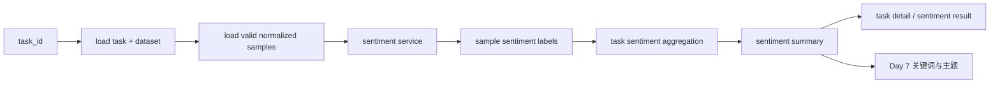
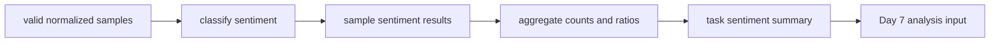

# Day 6：跑通情感分析主链

## 今天的总目标

- 把 Day 5 已经整理好的标准样本，真正推进成第一条可输出业务结果的分析主链
- 先把情感分析做成稳定的结构化结果，而不是返回一段松散自然语言
- 建立样本级情感标签和任务级情感聚合结果
- 让任务第一次具备“正向 / 中性 / 负向分布”这种可展示、可统计的业务输出
- 为 Day 7 的关键词提取与主题归类准备一层已经过输入清洗的分析基础

## 今天结束前，你必须拿到什么

- 一条真正清楚的 `normalized samples -> sentiment labels -> task summary` 主链
- 一套 Day 6 最小情感分析 schema
- 一套 Day 6 最小情感分析 service 设计
- 一份能讲清楚“为什么情感结果必须结构化”的判断标准
- 一份可以直接交给 Day 7 继续接关键词与主题的情感分析结果契约
- 一份当前仓库里 Day 6 应该新增哪些文件、哪些文件只做小改的落点说明

---

## Day 6 一图总览

一句话总结：

> Day 6 不是把分析做复杂，而是先把第一类最核心的业务判断稳定产出出来。

主链路先压缩成这一条：

```text
task
-> load valid normalized samples
-> classify sentiment per sample
-> build sample sentiment results
-> aggregate task sentiment summary
-> write back task sentiment facts
-> Day 7 关键词与主题
```

今天最不能混淆的 5 件事：

- Day 5 负责统一输入
- Day 6 负责在统一输入上输出第一类业务结果
- `sample sentiment` 和 `task sentiment summary` 不是一回事
- Day 6 的终点是“情感结果稳定结构化”，不是“所有分析能力都做完”
- Day 7 接的是已有情感结果和标准样本，不再回头处理原始输入

---

## 为什么这一天重要

很多人会误以为 Day 6 只是：

- 给每条文本打个正负面标签
- 随便接一个模型分类一下
- 先返回一个情感字段，后面再慢慢整理

这都不够准确。

Day 6 真正重要的地方在于：

> 从今天开始，SentiFlow 第一次不只是“能处理文本”，而是“能稳定产出有业务价值的结构化判断”。

如果没有这一步，后面的：

- 关键词提取
- 主题归类
- 问题归因
- 负面样本筛选
- 报表展示

都缺少一个最直观、最基础的结果层。

所以 Day 6 不是“补一个标签字段的一天”，  
而是系统第一次建立分析结果主链的一天。

---

## Day 6 整体架构



再压缩成仓库里真正的文件落点：

```text
router/tasks.py
-> services/preprocess_service.py
-> services/sentiment_service.py
-> shcemas/sentiment_schema.py
-> crud/task_crud.py
-> models/task_model.py
-> Day 7 再接关键词和主题 service
```

---

## 今天的边界要讲透

Day 6 解决的是：

```text
怎样拿到 Day 5 的有效标准样本
怎样对每条样本给出结构化情感标签
怎样把样本级结果聚合成任务级分布
怎样把情感结果写回任务事实
怎样给 Day 7 提供可复用的情感结果基础
```

Day 6 不解决的是：

```text
关键词怎样抽
主题怎样聚
问题归因怎样做
负面样本怎样做最终业务筛选
异步 worker 怎样接管整条分析链
报表怎样最终展示
```

### 今天之后，各层职责应该怎么理解

| 位置 | Day 6 负责什么 | Day 6 不负责什么 |
| --- | --- | --- |
| `router/tasks.py` | 提供触发情感分析和查看情感结果的 HTTP 入口 | 写模型推理细节 |
| `services/preprocess_service.py` | 提供有效标准样本读取能力 | 直接做情感分类 |
| `services/sentiment_service.py` | 编排情感分类、样本结果构建和任务级聚合 | 直接写 SQL |
| `shcemas/sentiment_schema.py` | 定义样本级结果和任务级结果模型 | 持有业务流程 |
| `crud/task_crud.py` | 回写情感状态、计数和摘要 | 直接做模型推理 |
| `models/task_model.py` | 为 Day 6 的情感结果留持久字段 | 承担情感分析判断 |
| `utils/` | 最多放很小的纯辅助函数 | 不承担核心情感业务逻辑 |

### 对当前仓库的处理原则

Day 6 对现有目录先做三类判断：

| 分类 | 目录 / 文件 | 处理方式 |
| --- | --- | --- |
| 直接复用 | `router/tasks.py` `services/preprocess_service.py` `crud/task_crud.py` | 接上 Day 6 的输入和任务回写 |
| 小改接入 | `models/task_model.py` `shcemas/` | 新增情感字段和情感专属 schema |
| 新增文件 | `services/sentiment_service.py` `shcemas/sentiment_schema.py` | 作为 Day 6 主线落点 |

这个判断很重要。  
它能防止 Day 6 一上来就为了“分析更强”引入太多层，结果第一条情感主链反而没先跑稳。

---

## 今天开始，先不要急着写关键词和主题

Day 6 最容易犯的错误就是：

- 一看到情感结果，就马上顺手做关键词和主题
- 一看到标准样本，就直接把 Day 7 的内容混进来
- 一看到分类输出，就只返回 `positive` / `negative` 这种松散字符串
- 一看到当前仓库还没有 `sentiment_service.py`，就顺手把完整结果中心、报表层、队列层一起补全

这些都不是 Day 6 的重点。

今天真正要解决的是：

> Day 5 整理好的标准样本，怎样才能先稳定产出第一类结构化分析结果。

如果这个问题没讲清楚，  
后面会出现两个典型坏结果：

- 情感分析只是一次临时调用，没有稳定结果契约
- 任务详情、结果页、后续分析都不知道该消费什么形状的数据

所以 Day 6 的关键词不是“分析做多”，而是：

```text
情感标签
结构化结果
样本级
任务级
聚合
结果契约
```

---

## 第 1 层：Day 6 的本质是什么

Day 1 定的是：

```text
边界
```

Day 2 定的是：

```text
任务流和信息架构
```

Day 3 定的是：

```text
后端应用骨架
```

Day 4 定的是：

```text
输入进入系统并挂到任务上
```

Day 5 定的是：

```text
原始文本怎样变成统一分析输入
```

Day 6 定的是：

```text
统一分析输入怎样变成第一类稳定分析结果
```

也就是说，Day 6 不是继续优化输入，  
而是开始回答另一个非常具体的问题：

```text
同样是一批标准样本
-> 怎样给每条样本稳定定性
-> 怎样形成整个任务的情感分布
-> 怎样让这些结果可查询、可复用、可展示
```

这一步一旦走通，  
SentiFlow 后面的分析层就不再只是围绕“文本输入”打转，而是开始围绕“结果事实”演进。

---

## 第 2 层：Day 6 的主链一定要从有效标准样本出发

今天你要先把 Day 6 的主链牢牢记成这样：

```text
task
-> load valid normalized samples
-> classify sentiment per sample
-> build sample sentiment results
-> aggregate task sentiment summary
-> write back task sentiment facts
```

这里最重要的不是步骤名字，  
而是你要看清楚：

- Day 6 接的是 `valid normalized samples`
- 不是重新接导入文件
- 不是重新做 Day 5 清洗
- 不是直接跳进 Day 7 的关键词和主题

### 为什么一定要从有效标准样本出发

因为 Day 5 已经做成了这条边界：

```text
dataset
-> preprocess
-> normalized samples
```

那么 Day 6 最稳的接法就应该是：

```text
normalized samples
-> sentiment labels
-> task summary
```

而不是：

```text
重新处理原始文本
-> 顺手重新清洗
-> 顺手做情感判断
```

后者会把 Day 5 和 Day 6 的边界重新打乱。

---

## 第 3 层：为什么 Day 6 一定要同时保留样本级结果和任务级结果

很多人会本能地只做两种极端之一：

```text
只给每条样本打标签
```

或者：

```text
只给整个任务一个情感分布
```

这两种都不够。

### 问题 1：只有样本级结果，不够支撑任务视角

如果只有一条条样本标签，  
那么任务详情页、报表页和后续统计层都会很难直接消费。

### 问题 2：只有任务级结果，不够支撑样本复查

如果只有：

- 正向多少
- 中性多少
- 负向多少

那你看不到：

- 哪条样本为什么被判成负向
- 后面 Day 8 怎么筛负面样本

### Day 6 最稳的做法

Day 6 一定要同时保留：

- `sample sentiment result`
- `task sentiment summary`

因为这两个层级分别服务不同问题：

- 样本级结果服务“逐条判断”
- 任务级结果服务“整体分布”

---

## 第 4 层：Day 6 先把情感结果契约讲清楚

今天最值得先定住的，不是你到底接哪种分类方式，  
而是 Day 6 产出的结果到底长什么样。

### 样本级情感结果至少应该有这些

```text
sample_id
content_clean
sentiment_label
sentiment_score
reason
```

### 任务级情感摘要至少应该有这些

```text
task_id
total_samples
positive_count
neutral_count
negative_count
positive_ratio
neutral_ratio
negative_ratio
dominant_sentiment
```

### 为什么值得今天先保留 `reason`

因为 Day 6 虽然不追求完整解释层，  
但至少应该给后面留一个最小解释入口。

这个 `reason` 可以很短，比如：

- 明显正向评价
- 情绪中性描述
- 包含明显抱怨语义

它的价值不在于一次就做到完美，  
而在于结果不是完全黑盒。

### 为什么值得今天先保留 `sentiment_score`

即使第一版先是简单分类，  
也值得给后面留一个强弱度位置。

因为后面你迟早会遇到：

- 负向里哪些更强烈
- 中性和弱负向怎样区分
- 结果排序怎样做

Day 6 可以先把这个位置留住。

### Day 6 不要过早做什么

今天不需要把情感结果扩成非常重的解释系统。  
比如这些内容先不用放进 Day 6 契约：

- 多标签情绪体系
- 情绪跨度时序分析
- 主题情绪交叉矩阵
- 细粒度 aspect sentiment

Day 6 的目标是先把第一类结果稳定下来，  
不是提前承载 Day 7 以后所有分析输出。

---

## 第 5 层：Day 6 最小情感分析步骤应该先有哪些

Day 6 最稳的做法，不是继续维护中文情绪词表。  
而是先把“标准样本 -> 预训练情感模型 -> 结构化结果”这条主链立住。

### 步骤 1：读取有效样本

至少要确保：

- 只读取 `is_valid = true` 的标准样本
- 不再对无效样本做情感分类
- 每条输入样本都已有稳定 `sample_id`

### 步骤 2：做样本级分类

至少先输出这 3 类：

- `positive`
- `neutral`
- `negative`

这是当前 MVP 最稳的起点。

如果选择 Hugging Face 预训练模型，今天要先接受一个现实：

- 很多中文情感模型是正负二分类
- 项目内部仍然需要保留 `neutral`
- 可以先用置信度阈值把低置信度样本归为 `neutral`
- 第一次运行时模型会自动下载并缓存，后续启动优先走本地缓存

### 步骤 3：构建样本级结果

至少先组装：

- 原样本引用
- 标签
- 分值
- 极简原因

### 步骤 4：做任务级聚合

至少先统计：

- 正向样本数
- 中性样本数
- 负向样本数
- 三类占比
- 主导情绪

### 步骤 5：结果回写

今天就应该能把最小事实写回任务层：

- 情感分析状态
- 三类计数
- 主导情绪
- 一份摘要

这一步非常重要。  
它让 Day 6 的工作结果从“临时分析输出”变成“任务事实的一部分”。

---

## 第 6 层：结合当前仓库，Day 6 最小落点应该放在哪

基于当前项目实际目录，  
Day 6 最稳的做法不是一下子引入完整结果中心，  
而是在已有骨架上补一条独立的情感分析主线：

```text
router/tasks.py
services/preprocess_service.py
services/sentiment_service.py
shcemas/sentiment_schema.py
crud/task_crud.py
models/task_model.py
```

### `router/tasks.py`

负责：

- 提供触发 Day 6 情感分析的入口
- 返回情感摘要或情感结果预览

### `services/preprocess_service.py`

负责：

- 提供有效标准样本读取能力

### `services/sentiment_service.py`

负责：

- 调用分类逻辑
- 组装样本级结果
- 组装任务级摘要
- 输出给 Day 7 的情感基础

### `shcemas/sentiment_schema.py`

负责：

- 定义情感标签枚举
- 定义样本级情感结果
- 定义任务级情感摘要

### `crud/task_crud.py`

负责：

- 更新任务情感状态
- 更新计数字段
- 更新任务级摘要

### `models/task_model.py`

负责：

- 给 Day 6 的情感分析结果留持久字段
- 至少稳定承接状态、计数和摘要

---

## 第 7 层：Day 6 最小接口建议长什么样

今天最关键的接口建议先有这两个：

- `POST /tasks/{task_id}/sentiment`
- `GET /tasks/{task_id}/sentiment`

### `POST /tasks/{task_id}/sentiment`

它的职责是：

- 读取当前任务关联的有效标准样本
- 执行 Day 6 的情感分析主链
- 返回样本级结果预览和任务级摘要

它不负责：

- 直接做关键词提取
- 直接做主题归类
- 直接写最终报表

### `GET /tasks/{task_id}/sentiment`

它的职责是：

- 查询当前任务是否已经有情感分析结果
- 返回三类计数、占比、主导情绪和样本预览

它的价值在于：

- 让 Day 6 有独立可验证出口
- 让 Day 7 可以明确知道情感结果是否已经准备好

---

## 第 8 层：Day 6 不建议做什么

### 不要今天就把关键词和主题偷偷接进来

Day 7 会专门处理：

- 高频关键词
- 热点词
- 风险词
- 主题归类

Day 6 只负责把第一类情感结果整理好。

### 不要让 `preprocess_service.py` 吞掉全部 Day 6 逻辑

Day 5 的 `preprocess_service.py` 重点是：

- 清洗
- 标准化
- 有效样本筛选

Day 6 如果继续把情感分析塞进去，  
这个 service 很快就会变成“输入层 + 结果层”的混合层。

### 不要只返回松散字符串

如果 Day 6 只返回：

```text
positive / neutral / negative
```

那后面你很难稳定支持：

- 分数
- 原因
- 任务级聚合
- 负向样本筛选

### 不要今天就把模型调用写得太重

Day 6 最稳的方式是先做：

- 三分类
- 样本级结构化结果
- 任务级聚合

而不是一开始就做：

- 多维情绪分类
- 复杂模型投票
- 平台特化情绪体系
- 情绪时间序列分析

### 不要今天就把异步执行和回调全接满

Day 6 当前更重要的是把“结果契约”和“主链边界”定清楚。  
真正由队列和 worker 接管整条分析链，是 Day 9 之后的主题。

---

## 上午学习：09:00 - 12:00

## 09:00 - 09:50：把 Day 6 的主问题讲顺

### 今天你要能顺着说出来

```text
Day 5 已经把原始文本变成了标准样本
-> Day 6 不再重复处理输入质量
-> Day 6 要从有效标准样本出发做情感分类
-> 先得到样本级标签
-> 再得到任务级情感分布
-> Day 7 再继续接关键词和主题
```

### 你必须能回答这两个问题

1. 为什么 Day 6 的起点必须是 `valid normalized samples`，而不是重新处理原始文本？
2. 为什么 Day 6 一定要同时保留样本级情感结果和任务级情感摘要？

---

## 09:50 - 10:40：先画 Day 6 的主链图

### Day 6 情感分析主链



### 这张图要表达什么

系统真正围绕的是：

- 有效标准样本
- 样本级情感结果
- 任务级情感摘要

而不是“临时跑了一次分类”这么局部的动作。

---

## 10:40 - 11:30：先整理 Day 6 的结果契约

### `steps/day6_sentiment_contract.md` 练手骨架版

````markdown
# Day 6 情感结果契约

## 样本级结果最小结构

- TODO

## 任务级摘要最小结构

- TODO

## Day 7 会消费什么

- TODO
````

### `steps/day6_sentiment_contract.md` 参考答案

````markdown
# Day 6 情感结果契约

## 样本级结果最小结构

- `sample_id`
- `content_clean`
- `sentiment_label`
- `sentiment_score`
- `reason`

## 任务级摘要最小结构

- `task_id`
- `total_samples`
- `positive_count`
- `neutral_count`
- `negative_count`
- `positive_ratio`
- `neutral_ratio`
- `negative_ratio`
- `dominant_sentiment`

## Day 7 会消费什么

- 已经带有情感标签的标准样本
- 任务级情感分布
- 负向样本候选范围
````

### 这一段你一定要看懂

Day 6 真正要统一的不是“调用哪个分类方法”，  
而是后面页面、统计层和 Day 7 看到的结果契约。

---

## 11:30 - 12:00：先决定今天怎么验收

### Day 6 最直接的验收方式

今天至少要能回答：

1. Day 6 的输入到底是什么？
2. Day 6 的输出到底是什么？
3. 为什么情感结果不能只有一个松散标签字符串？
4. Day 7 为什么可以直接接 Day 6 的输出继续做关键词和主题？

---

## 下午编码：14:00 - 18:00

## 14:00 - 14:40：先补 `shcemas/sentiment_schema.py`

建议先补：

- `SentimentLabel`
- `SampleSentimentResult`
- `TaskSentimentSummary`
- `SentimentResponse`

### `shcemas/sentiment_schema.py` 练手骨架版

```python
from pydantic import BaseModel


class SampleSentimentResult(BaseModel):
    # 你要做的事：
    # 1. 定义样本引用
    # 2. 定义情感标签
    # 3. 定义分数和原因
    raise NotImplementedError
```

### `shcemas/sentiment_schema.py` 参考答案

```python
from enum import Enum

from pydantic import BaseModel, Field


class SentimentLabel(str, Enum):
    positive = "positive"
    neutral = "neutral"
    negative = "negative"


class SampleSentimentResult(BaseModel):
    sample_id: str
    content_clean: str
    sentiment_label: SentimentLabel
    sentiment_score: float = Field(default=0.0)
    reason: str | None = None


class TaskSentimentSummary(BaseModel):
    task_id: str
    total_samples: int
    positive_count: int
    neutral_count: int
    negative_count: int
    positive_ratio: float
    neutral_ratio: float
    negative_ratio: float
    dominant_sentiment: SentimentLabel


class SentimentResponse(BaseModel):
    task_id: str
    summary: TaskSentimentSummary
    preview_results: list[SampleSentimentResult] = Field(default_factory=list)
```

### 这里要先理解的点

Day 6 的 schema 不是为了把前端返回写漂亮，  
而是为了先把情感结果这层边界真正立住。

---

## 14:40 - 15:20：先让 `services/preprocess_service.py` 暴露有效样本读取能力

Day 5 现在更强调的是摘要。  
Day 6 真正落地前，最值得先补的一步，是让它稳定暴露“有效标准样本”。

### `services/preprocess_service.py` 建议补的方法

```python
def get_valid_samples(self, dataset: Dataset) -> list[NormalizedSample]:
    ...
```

### 为什么这一步值得今天就做

因为 Day 6 真正要消费的不是：

- 原始 raw text
- 预处理摘要文字

而是：

- 已经过清洗和有效性判断的标准样本集合

这一步一旦立住，  
Day 6、Day 7、Day 8 都能沿着同一条标准样本主线继续往下走。

---

## 15:20 - 16:20：在 `services/sentiment_service.py` 里立住主链

在写 service 前，今天要先在项目配置里留出两个最小配置：

```python
SENTIMENT_MODEL_NAME: str = "IDEA-CCNL/Erlangshen-Roberta-330M-Sentiment"
SENTIMENT_NEUTRAL_THRESHOLD: float = 0.65
```

依赖层面至少需要：

```text
transformers
torch
```

这两个依赖只负责模型推理能力。  
不要因为接了模型，就把 Day 6 扩成模型训练、模型评测和模型管理平台。

建议先补：

- `__init__(...)`
- `classify_sample(...)`
- `_get_classifier(...)`
- `_map_model_label(...)`
- `build_sample_results(...)`
- `build_task_summary(...)`
- `run_sentiment(...)`

### `services/sentiment_service.py` 练手骨架版

```python
from typing import Any

from shcemas.preprocess_schema import NormalizedSample
from shcemas.sentiment_schema import SentimentLabel


class SentimentService:
    def __init__(self) -> None:
        # 你要做的事：
        # 1. 准备一个 classifier 缓存位置
        # 2. 不要在初始化阶段立刻下载模型
        # 3. 让第一次真实分类时再懒加载模型
        raise NotImplementedError

    def classify_sample(self, sample: NormalizedSample):
        # 你要做的事：
        # 1. 读取单条标准样本的清洗文本
        # 2. 调用 Hugging Face 情感分类模型
        # 3. 根据置信度阈值决定是否归为 neutral
        # 4. 把模型原始标签映射为项目内部标签
        raise NotImplementedError

    def _get_classifier(self):
        # 你要做的事：
        # 1. 如果 classifier 已存在，直接复用
        # 2. 如果不存在，再导入 transformers.pipeline
        # 3. 使用配置里的模型名创建 text-classification pipeline
        # 4. 返回可复用的 classifier
        raise NotImplementedError

    def _map_model_label(self, raw_label: str) -> SentimentLabel:
        # 你要做的事：
        # 1. 接收模型返回的原始 label
        # 2. 兼容 positive / negative / LABEL_0 / LABEL_1 等形式
        # 3. 转成 SentimentLabel
        # 4. 未识别时保守归为 neutral
        raise NotImplementedError

    def build_sample_results(self, samples: list[NormalizedSample]):
        # 你要做的事：
        # 1. 遍历所有有效样本
        # 2. 对每条样本调用 classify_sample
        # 3. 组装成样本级情感结果列表
        raise NotImplementedError

    def build_task_summary(self, task_id: str, results):
        # 你要做的事：
        # 1. 统计正向 / 中性 / 负向数量
        # 2. 计算三类占比
        # 3. 得到主导情绪
        # 4. 组装成任务级情感摘要
        raise NotImplementedError

    def run_sentiment(self, task_id: str, samples: list[NormalizedSample]):
        # 你要做的事：
        # 1. 先生成样本级情感结果
        # 2. 再生成任务级情感摘要
        # 3. 最后组装统一响应
        raise NotImplementedError
```

### `services/sentiment_service.py` 参考答案

```python
from collections import Counter
from typing import Any

from conf.settings import settings
from shcemas.preprocess_schema import NormalizedSample
from shcemas.sentiment_schema import (
    SampleSentimentResult,
    SentimentLabel,
    SentimentResponse,
    TaskSentimentSummary,
)


class SentimentService:
    def __init__(self) -> None:
        self.classifier: Any | None = None

    def classify_sample(self, sample: NormalizedSample) -> tuple[SentimentLabel, float, str]:
        text = sample.content_clean.strip()
        if not text:
            return SentimentLabel.neutral, 0.0, "空文本，默认中性"

        result = self._get_classifier()(text)[0]
        raw_label = str(result["label"])
        score = float(result["score"])

        if score < settings.SENTIMENT_NEUTRAL_THRESHOLD:
            return SentimentLabel.neutral, score, "模型置信度较低，归为中性"

        label = self._map_model_label(raw_label)
        return label, score, f"{settings.SENTIMENT_MODEL_NAME} 模型预测"

    def _get_classifier(self):
        if self.classifier is None:
            try:
                from transformers import pipeline
            except ImportError as exc:
                raise RuntimeError(
                    "缺少 transformers/torch 依赖，请先安装项目依赖后再运行情感分析"
                ) from exc

            self.classifier = pipeline(
                "text-classification",
                model=settings.SENTIMENT_MODEL_NAME,
            )
        return self.classifier

    @staticmethod
    def _map_model_label(raw_label: str) -> SentimentLabel:
        label = raw_label.lower()
        if label in {"positive", "pos", "label_1", "1"}:
            return SentimentLabel.positive
        if label in {"negative", "neg", "label_0", "0"}:
            return SentimentLabel.negative
        return SentimentLabel.neutral

    def build_sample_results(
        self,
        samples: list[NormalizedSample],
    ) -> list[SampleSentimentResult]:
        results = []
        for sample in samples:
            label, score, reason = self.classify_sample(sample)
            results.append(
                SampleSentimentResult(
                    sample_id=sample.sample_id,
                    content_clean=sample.content_clean,
                    sentiment_label=label,
                    sentiment_score=score,
                    reason=reason,
                )
            )
        return results

    def build_task_summary(
        self,
        task_id: str,
        results: list[SampleSentimentResult],
    ) -> TaskSentimentSummary:
        counter = Counter(item.sentiment_label for item in results)
        total = len(results)
        if total == 0:
            return TaskSentimentSummary(
                task_id=task_id,
                total_samples=0,
                positive_count=0,
                neutral_count=0,
                negative_count=0,
                positive_ratio=0.0,
                neutral_ratio=0.0,
                negative_ratio=0.0,
                dominant_sentiment=SentimentLabel.neutral,
            )

        positive_count = counter.get(SentimentLabel.positive, 0)
        neutral_count = counter.get(SentimentLabel.neutral, 0)
        negative_count = counter.get(SentimentLabel.negative, 0)

        dominant_sentiment = max(
            (
                SentimentLabel.positive,
                SentimentLabel.neutral,
                SentimentLabel.negative,
            ),
            key=lambda label: counter.get(label, 0),
        )

        return TaskSentimentSummary(
            task_id=task_id,
            total_samples=len(results),
            positive_count=positive_count,
            neutral_count=neutral_count,
            negative_count=negative_count,
            positive_ratio=round(positive_count / total, 4),
            neutral_ratio=round(neutral_count / total, 4),
            negative_ratio=round(negative_count / total, 4),
            dominant_sentiment=dominant_sentiment,
        )

    def run_sentiment(
        self,
        task_id: str,
        samples: list[NormalizedSample],
    ) -> SentimentResponse:
        results = self.build_sample_results(samples)
        summary = self.build_task_summary(task_id=task_id, results=results)
        return SentimentResponse(
            task_id=task_id,
            summary=summary,
            preview_results=results[:5],
        )


sentiment_service = SentimentService()
```

### 这里要先理解的点

1. Day 6 的核心是先把“标准样本 -> 情感结果”这层变成独立主链  
2. 这里直接使用 Hugging Face 预训练模型，是为了避免继续维护中文情绪词表穷举  
3. 即使后面替换成自训练模型，`SampleSentimentResult` 和 `TaskSentimentSummary` 这层边界仍然应该稳定  
4. `preview_results` 的价值很大，它给任务详情页和调试都留了稳定入口  
5. Day 7 要消费的，是情感结果 + 标准样本，而不是重新判一遍输入情绪  

---

## 16:20 - 17:00：给 `crud/task_crud.py` 和 `models/task_model.py` 留出 Day 6 落点

如果 Day 6 要可查询、可复盘，  
那 `task` 至少应该能承接一些情感分析结果事实。

### `models/task_model.py` 建议新增的字段

```python
sentiment_status: Mapped[str | None]
positive_count: Mapped[int | None]
neutral_count: Mapped[int | None]
negative_count: Mapped[int | None]
dominant_sentiment: Mapped[str | None]
sentiment_summary: Mapped[str | None]
```

### `crud/task_crud.py` 建议新增的方法

```python
async def update_task_sentiment_summary(
    session: AsyncSession,
    task_id: str,
    sentiment_status: str,
    positive_count: int,
    neutral_count: int,
    negative_count: int,
    dominant_sentiment: str,
    sentiment_summary: str,
) -> Task | None:
    ...
```

### 为什么 Day 6 值得补这一步

因为只要情感分析发生过，  
系统就应该能回答：

- 这个 task 有没有跑过情感分析
- 正向、中性、负向各有多少
- 当前任务主导情绪是什么

如果这些都不留痕，  
Day 6 的成果后面很难被查询和复盘。

---

## 17:00 - 17:40：把 `router/tasks.py` 的情感分析入口补出来

### `router/tasks.py` 练手骨架版

```python
@router.post("/{task_id}/sentiment")
async def run_task_sentiment(task_id: str):
    raise NotImplementedError
```

### `router/tasks.py` 参考答案

```python
from crud.dataset_crud import get_dataset_by_id
from crud.task_crud import get_task_detail
from services.preprocess_service import preprocess_service
from services.sentiment_service import sentiment_service
from utils.response import error_response, success_response


@router.post("/{task_id}/sentiment")
async def run_task_sentiment(task_id: str, db=Depends(get_db)):
    task = await get_task_detail(session=db, task_id=task_id)
    if task is None:
        return error_response(message="task not found", code=1, data=None)

    dataset = await get_dataset_by_id(session=db, dataset_id=task.dataset_id)
    if dataset is None:
        return error_response(message="dataset not found", code=1, data=None)

    samples = preprocess_service.get_valid_samples(dataset=dataset)
    response = sentiment_service.run_sentiment(task_id=task_id, samples=samples)
    return success_response(data=response.model_dump(), message="sentiment completed")
```

### 为什么 router 层今天仍然一定要克制

因为 Day 6 的 router 还是只应该做：

- 查 task
- 查 dataset
- 拿有效标准样本
- 调 service
- 返回统一响应

如果你今天就在 router 里写分类逻辑，  
后面 Day 7、Day 8 会更难收。

---

## 17:40 - 18:00：整理 Day 7 的输入

Day 7 会开始进入：

- 高频关键词
- 热点词
- 风险词
- 主题归类

所以 Day 6 结束前，  
你至少要准备好这些输入：

- 每条有效样本都有稳定 `sentiment_label`
- 任务已经有最小情感分布摘要
- 负向样本已经有候选范围
- 情感结果已经能被页面和后续统计层稳定读取

这样 Day 7 才不用再回头补第一层情绪判断。

---

## 晚上复盘：20:00 - 21:00

### 今晚你必须自己讲顺的 8 个点

1. Day 6 的本质为什么是“第一类结构化分析结果落地”，不是“继续做输入清洗”？  
2. 为什么 Day 6 必须从 `valid normalized samples` 出发，而不是重新处理原始文本？  
3. 为什么 Day 6 一定要同时保留样本级结果和任务级摘要？  
4. 为什么情感结果不能只是一个松散字符串？  
5. 为什么 `sentiment_service.py` 不该塞回 `preprocess_service.py`？  
6. 为什么 Day 6 要有自己的 schema、service 和任务回写字段？  
7. 为什么 Day 7 接的是情感结果 + 标准样本，而不是重新判一遍情绪？  
8. 今天的情感结果为什么应该有可查询、可解释的摘要？  

---

## 今日验收标准

- `steps/day6.md` 对 Day 6 的目标、边界和文件落点讲清楚
- Day 6 的输入输出契约讲清楚
- 样本级情感结果和任务级情感摘要的最小结构讲清楚
- 情感分析主链的最小步骤讲清楚
- `services/sentiment_service.py` 的职责讲清楚
- `shcemas/sentiment_schema.py` 的最小设计讲清楚
- `router/tasks.py` 的情感分析入口讲清楚
- Day 7 的关键词与主题输入已经准备好

---

## 今天最容易踩的坑

### 坑 1：把 Day 6 当成 Day 5 的附属步骤

问题：

- 情感分析逻辑继续塞在预处理层
- Day 5 和 Day 6 边界重新混掉

规避建议：

- Day 5 到 `normalized samples`
- Day 6 从 `normalized samples` 开始进入情感分析

### 坑 2：只做样本标签，不做任务聚合

问题：

- 结果页和报表页没有稳定摘要
- 后续统计层不好接

规避建议：

- 同时保留样本级结果
- 同时保留任务级摘要

### 坑 3：只做任务分布，不保留样本结果

问题：

- 看不到具体负向样本
- Day 8 很难继续做代表样本和问题归因

规避建议：

- 保留 `preview_results`
- 保留样本级 `sentiment_label`

### 坑 4：今天就把 Day 7 内容提前混进来

问题：

- 情感主链边界失焦
- 关键词、主题、情绪三层逻辑糊在一起

规避建议：

- Day 6 只先跑通情感主链
- Day 7 再专门处理关键词和主题

### 坑 5：结果契约太松散

问题：

- 后面不同接口各返回各的字段
- 结果页和任务页很难统一消费

规避建议：

- 先稳定 `SampleSentimentResult`
- 先稳定 `TaskSentimentSummary`

### 坑 6：今天就把模型编排写得太重

问题：

- 工程复杂度陡增
- Day 6 迟迟立不住最小主链

规避建议：

- 先用一个 Hugging Face 预训练模型接住 `classify_sample`
- 先用置信度阈值补上项目需要的 `neutral`
- 不在 Day 6 做训练平台、评测平台和多模型路由
- 后面有标注数据后，再替换成项目自训练模型

---

## 给明天的交接提示

明天开始，SentiFlow 就不只是“知道用户情绪偏正还是偏负”，  
而是要开始真正回答另一个业务问题：

```text
大家到底在讨论什么
```

也就是说，后面会继续走向：

```text
normalized samples
-> sentiment analysis
-> sentiment summary
-> keyword extraction
-> topic grouping
```

所以 Day 6 最关键的交接只有一句话：

```text
先把标准样本稳定变成样本级情感标签和任务级情感分布，Day 7 的关键词与主题分析才会建立在真正有业务判断的结果基础上。
```
