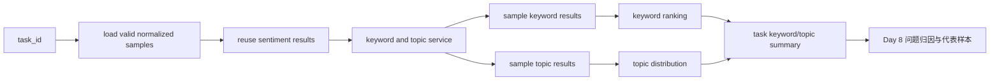
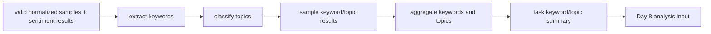

# Day 7：建立关键词提取与主题归类主链

## 今天的总目标

- 把 Day 6 已经产出的情感结果和标准样本，真正推进成第二类可展示的结构化分析结果
- 先把关键词提取和主题归类做成稳定的结构化输出，而不是一堆临时字符串拼接
- 建立样本级关键词 / 主题结果和任务级关键词排行 / 主题分布
- 让任务第一次具备“大家到底在讨论什么”这种可解释业务输出
- 为 Day 8 的问题归因与代表样本整理准备一层已经带有情绪和内容结构的分析基础

## 今天结束前，你必须拿到什么

- 一条真正清楚的 `normalized samples + sentiment results -> keywords / topics -> task summary` 主链
- 一套 Day 7 最小关键词与主题 schema
- 一套 Day 7 最小关键词与主题 service 设计
- 一份能讲清楚“为什么关键词和主题结果必须结构化”的判断标准
- 一份可以直接交给 Day 8 继续接问题归因和代表样本的结果契约
- 一份当前仓库里 Day 7 应该新增哪些文件、哪些文件只做小改的落点说明

---

## Day 7 一图总览

一句话总结：

> Day 7 不是把分析做得更花，而是先把“情绪判断”进一步推进成“内容结构判断”。

主链路先压缩成这一条：

```text
task
-> load valid normalized samples
-> reuse sentiment results
-> extract keywords per sample
-> classify topic per sample
-> aggregate keyword ranking
-> aggregate topic distribution
-> Day 8 问题归因与代表样本
```

今天最不能混淆的 5 件事：

- Day 6 负责先给出情绪判断
- Day 7 负责在已有情绪判断基础上回答“内容在说什么”
- `sample keyword/topic result` 和 `task keyword/topic summary` 不是一回事
- Day 7 的终点是“关键词与主题结果稳定结构化”，不是“问题归因已经做完”
- Day 8 接的是已有情绪结果 + 内容结构结果，不再回头补关键词和主题底座

---

## 为什么这一天重要

很多人会误以为 Day 7 只是：

- 从文本里随便提几个词
- 给内容起几个主题名字
- 先拼一点关键词和主题字段，后面再慢慢整理

这都不够准确。

Day 7 真正重要的地方在于：

> 从今天开始，SentiFlow 不只知道用户情绪偏正还是偏负，还开始知道用户到底在讨论什么。

如果没有这一步，后面的：

- 问题归因
- 代表样本筛选
- 负向问题聚类
- 报表解释
- 业务结论输出

都很难摆脱“只有情绪，没有内容结构”的局面。

所以 Day 7 不是“补几个关键词的一天”，  
而是系统第一次建立内容结构主链的一天。

---

## Day 7 整体架构



再压缩成仓库里真正的文件落点：

```text
router/tasks.py
-> services/preprocess_service.py
-> services/sentiment_service.py
-> services/topic_service.py
-> shcemas/topic_schema.py
-> crud/task_crud.py
-> models/task_model.py
-> Day 8 再接归因和代表样本 service
```

---

## 今天的边界要讲透

Day 7 解决的是：

```text
怎样拿到 Day 5 的有效标准样本
怎样复用 Day 6 的情感结果
怎样给每条样本提取关键词
怎样给每条样本归类主题
怎样把样本级结果聚合成任务级关键词排行和主题分布
怎样给 Day 8 提供可复用的内容结构结果基础
```

Day 7 不解决的是：

```text
问题归因怎样做
代表样本怎样最终筛选
负面问题怎样做最终业务收束
异步 worker 怎样接管整条分析链
报表怎样最终展示
```

### 今天之后，各层职责应该怎么理解

| 位置 | Day 7 负责什么 | Day 7 不负责什么 |
| --- | --- | --- |
| `router/tasks.py` | 提供触发关键词与主题分析和查看结果的 HTTP 入口 | 写模型调用和内容分析细节 |
| `services/preprocess_service.py` | 提供有效标准样本读取能力 | 直接做内容结构分析 |
| `services/sentiment_service.py` | 提供可复用的情感结果契约 | 直接承担 Day 7 主链 |
| `services/topic_service.py` | 编排 LLM 内容结构分析、样本结果构建和任务级聚合 | 直接写 SQL |
| `shcemas/topic_schema.py` | 定义样本级关键词 / 主题结果和任务级摘要 | 持有业务流程 |
| `crud/task_crud.py` | 回写关键词排行、主题分布和分析状态 | 直接做模型调用 |
| `models/task_model.py` | 为 Day 7 的关键词和主题结果留持久字段 | 承担内容分析判断 |

### 对当前仓库的处理原则

Day 7 对现有目录先做三类判断：

| 分类 | 目录 / 文件 | 处理方式 |
| --- | --- | --- |
| 直接复用 | `router/tasks.py` `services/preprocess_service.py` `services/sentiment_service.py` `crud/task_crud.py` | 接上 Day 7 的输入和任务回写 |
| 小改接入 | `models/task_model.py` `shcemas/` | 新增关键词 / 主题字段和专属 schema |
| 新增文件 | `services/topic_service.py` `shcemas/topic_schema.py` | 作为 Day 7 主线落点 |

这个判断很重要。  
它能防止 Day 7 一上来就为了“内容理解更强”做太多外围设计，结果关键词和主题主链反而没先跑稳。

---

## 今天开始，先不要急着写问题归因

Day 7 最容易犯的错误就是：

- 一看到负向情绪，就马上顺手开始做问题归因
- 一看到关键词和主题，就直接把 Day 8 的内容混进来
- 一看到结果输出，就只返回几组松散关键词列表
- 一看到当前仓库里还没有 `topic_service.py`，就顺手把报表层、检索层、聚类层一起补全

这些都不是 Day 7 的重点。

今天真正要解决的是：

> Day 5 的标准样本和 Day 6 的情绪判断，怎样才能先稳定产出一层“内容结构结果”。

如果这个问题没讲清楚，  
后面会出现两个典型坏结果：

- 关键词和主题只是临时分析输出，没有稳定契约
- Day 8 的归因、样本解释、结果页都不知道该消费什么形状的数据

所以 Day 7 的关键词不是“分析做满”，而是：

```text
关键词
主题
样本级
任务级
内容结构
结构化结果
结果契约
```

---

## 第 1 层：Day 7 的本质是什么

Day 1 定的是：

```text
边界
```

Day 2 定的是：

```text
任务流和信息架构
```

Day 3 定的是：

```text
后端应用骨架
```

Day 4 定的是：

```text
输入进入系统并挂到任务上
```

Day 5 定的是：

```text
原始文本怎样变成统一分析输入
```

Day 6 定的是：

```text
统一分析输入怎样变成第一类稳定分析结果
```

Day 7 定的是：

```text
第一类情绪结果怎样继续变成内容结构结果
```

也就是说，Day 7 不是继续重复 Day 6 的情感判断，  
而是开始回答另一个非常具体的问题：

```text
同样是一批已带情绪标签的标准样本
-> 大家到底在谈什么
-> 高频词是什么
-> 风险词是什么
-> 这些内容能归到哪些主题
```

这一步一旦走通，  
SentiFlow 的结果层就会从“只有情绪”推进到“有情绪 + 有内容结构”。

---

## 第 2 层：Day 7 的主链一定要从标准样本和情感结果出发

今天你要先把 Day 7 的主链牢牢记成这样：

```text
task
-> load valid normalized samples
-> reuse sentiment results
-> extract keywords per sample
-> classify topic per sample
-> aggregate keyword ranking
-> aggregate topic distribution
```

这里最重要的不是步骤名字，  
而是你要看清楚：

- Day 7 接的是 `valid normalized samples`
- Day 7 复用的是 Day 6 的情感结果
- 不是重新接导入文件
- 不是重新做 Day 5 清洗
- 不是直接跳进 Day 8 的问题归因

### 为什么一定要从标准样本和情感结果出发

因为 Day 6 已经做成了这条边界：

```text
normalized samples
-> sentiment labels
-> task sentiment summary
```

那么 Day 7 最稳的接法就应该是：

```text
normalized samples + sentiment labels
-> keywords and topics
-> task keyword/topic summary
```

而不是：

```text
重新处理原始文本
-> 顺手补情感
-> 顺手做主题
```

后者会把 Day 5、Day 6、Day 7 的边界一起打乱。

---

## 第 3 层：为什么 Day 7 一定要同时保留样本级结果和任务级结果

很多人会本能地只做两种极端之一：

```text
只给整个任务一份关键词排行
```

或者：

```text
只给每条样本一组关键词和主题
```

这两种都不够。

### 问题 1：只有任务级结果，不够支撑样本解释

如果只有：

- 高频关键词列表
- 主题占比

那你看不到：

- 哪条样本命中了哪些关键词
- 哪条样本为什么会被分到这个主题

### 问题 2：只有样本级结果，不够支撑整体分布

如果只有每条样本的关键词和主题，  
那么结果页、图表页和报表页都很难直接消费。

### Day 7 最稳的做法

Day 7 一定要同时保留：

- `sample keyword/topic result`
- `task keyword/topic summary`

因为这两个层级分别服务不同问题：

- 样本级结果服务“具体内容解释”
- 任务级结果服务“整体结构分布”

---

## 第 4 层：Day 7 先把关键词和主题结果契约讲清楚

今天最值得先定住的，不是模型提示词到底怎么写，  
而是 Day 7 产出的结果到底长什么样。

### 样本级关键词与主题结果至少应该有这些

```text
sample_id
content_clean
sentiment_label
keywords
topic_label
topic_reason
```

### 任务级关键词摘要至少应该有这些

```text
task_id
top_keywords
risk_keywords
keyword_frequency
```

### 任务级主题摘要至少应该有这些

```text
task_id
topic_distribution
dominant_topic
```

### 为什么值得今天先保留 `topic_reason`

因为 Day 7 虽然不追求完整归因层，  
但至少应该给后面留一个最小解释入口。

这个 `topic_reason` 可以很短，比如：

- 模型判断主要讨论物流履约
- 模型判断主要讨论价格体验
- 模型判断主要讨论服务售后

它的价值不在于一次做到完美，  
而在于结果不是完全黑盒。

### 为什么值得今天先区分 `top_keywords` 和 `risk_keywords`

因为业务上这两类词经常不是一回事：

- 高频词不一定是风险词
- 风险词未必整体频次最高

Day 7 值得先把这个结构位置留住。

### Day 7 不要过早做什么

今天不需要把关键词和主题结果扩成非常重的知识结构。  
比如这些内容先不用放进 Day 7 契约：

- 图谱关系
- topic embedding
- 跨任务主题演化
- 主题层级树

Day 7 的目标是先把内容结构结果稳定下来，  
不是提前承载 Day 8 以后所有分析输出。

---

## 第 5 层：Day 7 最小关键词与主题步骤应该先有哪些

Day 7 最稳的做法，不是继续维护中文关键词和主题词表。  
而是先把“标准样本 + 情感结果 -> LLM 内容结构分析 -> 结构化主题结果”这条主链立住。

### 步骤 1：读取有效样本与情感标签

至少要确保：

- 只读取 `is_valid = true` 的标准样本
- 每条输入样本都有稳定 `sample_id`
- 每条样本都已经有 `sentiment_label`

### 步骤 2：调用模型生成样本级关键词

至少先输出：

- 该样本的关键词列表
- 其中命中的风险词列表

### 步骤 3：调用模型生成样本级主题

至少先输出：

- 一个主题标签
- 一个极简归类原因

### 步骤 4：做任务级关键词聚合

至少先统计：

- 高频关键词
- 关键词频次
- 风险词列表

### 步骤 5：做任务级主题聚合

至少先统计：

- 各主题数量
- 各主题占比
- 主导主题

### 步骤 6：结果回写

今天就应该能把最小事实写回任务层：

- 关键词与主题分析状态
- 高频关键词摘要
- 主题分布摘要
- 一份结构化总结

这一步非常重要。  
它让 Day 7 的工作结果从“临时提取输出”变成“任务事实的一部分”。

---

## 第 6 层：结合当前仓库，Day 7 最小落点应该放在哪

基于当前项目实际目录，  
Day 7 最稳的做法不是一下子引入完整知识层，  
而是在已有骨架上补一条独立的关键词与主题主线：

```text
router/tasks.py
services/preprocess_service.py
services/sentiment_service.py
services/topic_service.py
shcemas/topic_schema.py
crud/task_crud.py
models/task_model.py
```

### `router/tasks.py`

负责：

- 提供触发 Day 7 分析的入口
- 返回关键词排行、主题分布或样本预览

### `services/preprocess_service.py`

负责：

- 提供有效标准样本读取能力

### `services/sentiment_service.py`

负责：

- 提供 Day 6 情感结果契约

### `services/topic_service.py`

负责：

- 调用关键词提取逻辑
- 调用主题归类逻辑
- 组装样本级结果
- 组装任务级关键词与主题摘要
- 输出给 Day 8 的内容结构基础

### `shcemas/topic_schema.py`

负责：

- 定义样本级关键词与主题结果
- 定义任务级关键词摘要
- 定义任务级主题摘要

### `crud/task_crud.py`

负责：

- 更新关键词与主题分析状态
- 更新摘要字段

### `models/task_model.py`

负责：

- 给 Day 7 的关键词和主题结果留持久字段
- 至少稳定承接状态、摘要和分布

---

## 第 7 层：Day 7 最小接口建议长什么样

今天最关键的接口建议先有这两个：

- `POST /tasks/{task_id}/topics`
- `GET /tasks/{task_id}/topics`

### `POST /tasks/{task_id}/topics`

它的职责是：

- 读取当前任务关联的有效标准样本
- 复用该任务已有的情感结果
- 执行 Day 7 的关键词与主题分析主链
- 返回样本级结果预览和任务级摘要

它不负责：

- 直接做问题归因
- 直接做代表样本筛选
- 直接写最终报表

### `GET /tasks/{task_id}/topics`

它的职责是：

- 查询当前任务是否已经有关键词与主题分析结果
- 返回关键词排行、风险词、主题分布和样本预览

它的价值在于：

- 让 Day 7 有独立可验证出口
- 让 Day 8 可以明确知道内容结构结果是否已经准备好

---

## 第 8 层：Day 7 不建议做什么

### 不要今天就把问题归因偷偷接进来

Day 8 会专门处理：

- 物流、质量、价格、服务、功能等问题归因
- 代表样本整理
- 负向问题聚焦

Day 7 只负责先把关键词和主题结果整理好。

### 不要让 `sentiment_service.py` 吞掉全部 Day 7 逻辑

Day 6 的 `sentiment_service.py` 重点是：

- 样本级情感标签
- 任务级情感分布

Day 7 如果继续把关键词和主题塞进去，  
这个 service 很快就会变成“情绪层 + 内容结构层”的混合层。

### 不要只返回几组散装关键词

如果 Day 7 只返回：

```text
["物流", "价格", "包装"]
```

那后面你很难稳定支持：

- 风险词
- 关键词频次
- 主题分布
- 样本解释

### 不要今天就把主题建模写得太重

Day 7 最稳的方式是先做：

- 样本级关键词
- 样本级主题
- 任务级排行与分布

而不是一开始就做：

- 聚类算法大全
- 复杂 topic modeling
- 多层级主题树
- 跨任务主题演化

### 不要今天就把异步执行和回调全接满

Day 7 当前更重要的是把“内容结构结果契约”和“主链边界”定清楚。  
真正由队列和 worker 接管整条分析链，是 Day 9 之后的主题。

---

## 上午学习：09:00 - 12:00

## 09:00 - 09:50：把 Day 7 的主问题讲顺

### 今天你要能顺着说出来

```text
Day 5 已经把原始文本变成了标准样本
-> Day 6 已经把标准样本变成了情感结果
-> Day 7 不再重复处理输入质量和情绪判断
-> Day 7 要开始回答“大家在讨论什么”
-> 先得到样本级关键词和主题
-> 再得到任务级关键词排行和主题分布
-> Day 8 再继续接问题归因与代表样本
```

### 你必须能回答这两个问题

1. 为什么 Day 7 的起点必须是 `valid normalized samples + sentiment results`，而不是重新处理原始文本？
2. 为什么 Day 7 一定要同时保留样本级关键词 / 主题结果和任务级摘要？

---

## 09:50 - 10:40：先画 Day 7 的主链图

### Day 7 关键词与主题主链



### 这张图要表达什么

系统真正围绕的是：

- 有效标准样本
- 情感结果
- 样本级关键词与主题结果
- 任务级关键词与主题摘要

而不是“临时提了几个词、起了几个主题”这么局部的动作。

---

## 10:40 - 11:30：先整理 Day 7 的结果契约

### `steps/day7_topic_contract.md` 练手骨架版

````markdown
# Day 7 关键词与主题结果契约

## 样本级结果最小结构

- TODO

## 任务级关键词摘要最小结构

- TODO

## 任务级主题摘要最小结构

- TODO

## Day 8 会消费什么

- TODO
````

### `steps/day7_topic_contract.md` 参考答案

````markdown
# Day 7 关键词与主题结果契约

## 样本级结果最小结构

- `sample_id`
- `content_clean`
- `sentiment_label`
- `keywords`
- `risk_keywords`
- `topic_label`
- `topic_reason`

## 任务级关键词摘要最小结构

- `task_id`
- `top_keywords`
- `risk_keywords`
- `keyword_frequency`

## 任务级主题摘要最小结构

- `task_id`
- `topic_distribution`
- `dominant_topic`

## Day 8 会消费什么

- 已带情感标签的标准样本
- 样本级关键词与主题结果
- 任务级关键词排行
- 任务级主题分布
````

### 这一段你一定要看懂

Day 7 真正要统一的不是“到底用哪种模型提示词”，  
而是后面页面、统计层和 Day 8 看到的内容结构结果契约。

---

## 11:30 - 12:00：先决定今天怎么验收

### Day 7 最直接的验收方式

今天至少要能回答：

1. Day 7 的输入到底是什么？
2. Day 7 的输出到底是什么？
3. 为什么关键词和主题结果不能只是几组松散字符串？
4. Day 8 为什么可以直接接 Day 7 的输出继续做问题归因和代表样本？

---

## 下午编码：14:00 - 18:00

## 14:00 - 14:40：先补 `shcemas/topic_schema.py`

建议先补：

- `SampleTopicResult`
- `TaskKeywordSummary`
- `TaskTopicSummary`
- `TopicAnalysisResponse`

### `shcemas/topic_schema.py` 练手骨架版

```python
from pydantic import BaseModel


class SampleTopicResult(BaseModel):
    # 你要做的事：
    # 1. 定义样本引用
    # 2. 定义关键词和风险词
    # 3. 定义主题标签和原因
    raise NotImplementedError
```

### `shcemas/topic_schema.py` 参考答案

```python
from pydantic import BaseModel, Field

from shcemas.sentiment_schema import SentimentLabel


class SampleTopicResult(BaseModel):
    sample_id: str
    content_clean: str
    sentiment_label: SentimentLabel
    keywords: list[str] = Field(default_factory=list)
    risk_keywords: list[str] = Field(default_factory=list)
    topic_label: str
    topic_reason: str | None = None


class TaskKeywordSummary(BaseModel):
    task_id: str
    top_keywords: list[str] = Field(default_factory=list)
    risk_keywords: list[str] = Field(default_factory=list)
    keyword_frequency: dict[str, int] = Field(default_factory=dict)


class TaskTopicSummary(BaseModel):
    task_id: str
    topic_distribution: dict[str, int] = Field(default_factory=dict)
    dominant_topic: str


class TopicAnalysisResponse(BaseModel):
    task_id: str
    keyword_summary: TaskKeywordSummary
    topic_summary: TaskTopicSummary
    preview_results: list[SampleTopicResult] = Field(default_factory=list)
```

### 这里要先理解的点

Day 7 的 schema 不是为了把前端结果写好看，  
而是为了先把关键词与主题这层边界真正立住。

---

## 14:40 - 15:20：先让 Day 6 的结果暴露成可复用输入

Day 7 真正落地前，最值得先补的一步，是让它稳定拿到：

- 有效标准样本
- 对应样本的 `sentiment_label`

### `services/sentiment_service.py` 建议补的方法

```python
def get_sentiment_preview_map(self, response: SentimentResponse) -> dict[str, SampleSentimentResult]:
    ...
```

### 为什么这一步值得今天就做

因为 Day 7 真正要消费的不是：

- 原始文本
- 单独一份任务级情绪摘要

而是：

- 带有情绪判断的样本结果集合

这一步一旦立住，  
Day 7 和 Day 8 都能沿着“标准样本 + 情绪结果”的同一条主线继续往下走。

---

## 15:20 - 16:20：在 `services/topic_service.py` 里立住主链

建议先补：

- `analyze_sample(...)`
- `_build_headers(...)`
- `_chat_completions_url(...)`
- `_parse_model_json(...)`
- `_string_list(...)`
- `build_sample_topic_results(...)`
- `build_keyword_summary(...)`
- `build_topic_summary(...)`
- `run_topic_analysis(...)`

### `services/topic_service.py` 练手骨架版

```python
from typing import Any

from shcemas.preprocess_schema import NormalizedSample
from shcemas.sentiment_schema import SampleSentimentResult


class TopicService:
    def analyze_sample(self, sample: NormalizedSample) -> dict[str, Any]:
        # 你要做的事：
        # 1. 调用 OpenAI 兼容的 chat completions 接口
        # 2. 要求模型只返回 JSON
        # 3. JSON 中必须包含 keywords、risk_keywords、topic_label、topic_reason
        # 4. 不要在这里写中文关键词命中规则
        raise NotImplementedError

    def _chat_completions_url(self) -> str:
        # 你要做的事：
        # 1. 读取配置中的 LLM_BASE_URL
        # 2. 兼容已经以 /chat/completions 结尾的地址
        # 3. 返回最终请求地址
        raise NotImplementedError

    def _build_headers(self) -> dict[str, str]:
        # 你要做的事：
        # 1. 设置 JSON 请求头
        # 2. 如果配置了 DASHSCOPE_API_KEY，就补 Authorization
        raise NotImplementedError

    def _parse_model_json(self, content: str) -> dict[str, Any]:
        # 你要做的事：
        # 1. 解析模型返回的 JSON
        # 2. 规整关键词和风险词为字符串列表
        # 3. 规整 topic_label，空值时归为通用反馈
        # 4. 不要在这里维护固定中文主题词表
        raise NotImplementedError

    def _string_list(self, value: Any) -> list[str]:
        # 你要做的事：
        # 1. 接收模型返回的任意值
        # 2. 只有 list 才继续处理
        # 3. 去空、去重，并限制最大数量
        raise NotImplementedError

    def build_sample_topic_results(
        self,
        samples: list[NormalizedSample],
        sentiment_map: dict[str, SampleSentimentResult],
    ):
        # 你要做的事：
        # 1. 遍历所有有效样本
        # 2. 调用 analyze_sample 得到关键词、风险词和主题
        # 3. 读取情感结果并组装样本级结果
        # 4. 组装成样本级结果列表
        raise NotImplementedError

    def build_keyword_summary(self, task_id: str, results):
        # 你要做的事：
        # 1. 聚合关键词频次
        # 2. 得到 top keywords
        # 3. 得到 risk keywords
        raise NotImplementedError

    def build_topic_summary(self, task_id: str, results):
        # 你要做的事：
        # 1. 聚合主题数量
        # 2. 计算主导主题
        # 3. 组装成任务级主题摘要
        raise NotImplementedError

    def run_topic_analysis(
        self,
        task_id: str,
        samples: list[NormalizedSample],
        sentiment_map: dict[str, SampleSentimentResult],
    ):
        # 你要做的事：
        # 1. 先生成样本级关键词与主题结果
        # 2. 再生成任务级关键词摘要
        # 3. 再生成任务级主题摘要
        # 4. 最后组装统一响应
        raise NotImplementedError
```

### `services/topic_service.py` 参考答案

```python
from collections import Counter
import json
from typing import Any

import httpx

from conf.settings import settings
from shcemas.preprocess_schema import NormalizedSample
from shcemas.sentiment_schema import SampleSentimentResult, SentimentLabel
from shcemas.topic_schema import (
    SampleTopicResult,
    TaskKeywordSummary,
    TaskTopicSummary,
    TopicAnalysisResponse,
)


class TopicService:
    def analyze_sample(self, sample: NormalizedSample) -> dict[str, Any]:
        if not settings.LLM_BASE_URL or not settings.LLM_MODEL_NAME:
            raise RuntimeError("缺少 LLM_BASE_URL 或 LLM_MODEL_NAME，无法执行主题分析")

        response = httpx.post(
            self._chat_completions_url(),
            headers=self._build_headers(),
            json={
                "model": settings.LLM_MODEL_NAME,
                "messages": [
                    {
                        "role": "system",
                        "content": (
                            "你是舆情分析助手。请只输出 JSON，不要输出 Markdown。"
                            "JSON 字段必须包含 keywords、risk_keywords、topic_label、topic_reason。"
                            "topic_label 用一个简短中文短语概括评论主题，不要照抄固定词表。"
                        ),
                    },
                    {
                        "role": "user",
                        "content": (
                            "分析下面这条中文评论，抽取关键词、风险词，并给出一个业务主题。\n"
                            f"评论：{sample.content_clean}"
                        ),
                    },
                ],
                "temperature": 0,
            },
            timeout=settings.LLM_TIMEOUT_SECONDS,
        )
        response.raise_for_status()
        content = response.json()["choices"][0]["message"]["content"]
        return self._parse_model_json(content)

    @staticmethod
    def _chat_completions_url() -> str:
        base_url = settings.LLM_BASE_URL.rstrip("/")
        if base_url.endswith("/chat/completions"):
            return base_url
        return f"{base_url}/chat/completions"

    def _build_headers(self) -> dict[str, str]:
        headers = {"Content-Type": "application/json"}
        if settings.DASHSCOPE_API_KEY:
            headers["Authorization"] = f"Bearer {settings.DASHSCOPE_API_KEY}"
        return headers

    @classmethod
    def _parse_model_json(cls, content: str) -> dict[str, Any]:
        content = content.strip()
        if content.startswith("```"):
            content = content.strip("`")
            if content.lower().startswith("json"):
                content = content[4:].strip()
        payload = json.loads(content)
        topic_label = str(payload.get("topic_label") or "").strip() or "通用反馈"
        return {
            "keywords": cls._string_list(payload.get("keywords")),
            "risk_keywords": cls._string_list(payload.get("risk_keywords")),
            "topic_label": topic_label,
            "topic_reason": str(payload.get("topic_reason") or "模型未返回明确原因"),
        }

    @staticmethod
    def _string_list(value: Any) -> list[str]:
        if not isinstance(value, list):
            return []

        items = []
        for item in value:
            text = str(item).strip()
            if text and text not in items:
                items.append(text)
        return items[:10]

    def build_sample_topic_results(
        self,
        samples: list[NormalizedSample],
        sentiment_map: dict[str, SampleSentimentResult],
    ) -> list[SampleTopicResult]:
        results = []
        for sample in samples:
            analysis = self.analyze_sample(sample)

            sentiment_result = sentiment_map.get(sample.sample_id)
            sentiment_label = (
                sentiment_result.sentiment_label
                if sentiment_result is not None
                else SentimentLabel.neutral
            )

            results.append(
                SampleTopicResult(
                    sample_id=sample.sample_id,
                    content_clean=sample.content_clean,
                    sentiment_label=sentiment_label,
                    keywords=analysis["keywords"],
                    risk_keywords=analysis["risk_keywords"],
                    topic_label=analysis["topic_label"],
                    topic_reason=analysis["topic_reason"],
                )
            )
        return results

    def build_keyword_summary(
        self,
        task_id: str,
        results: list[SampleTopicResult],
    ) -> TaskKeywordSummary:
        counter = Counter()
        risk_words = set()

        for item in results:
            counter.update(item.keywords)
            risk_words.update(item.risk_keywords)

        top_keywords = [word for word, _ in counter.most_common(10)]

        return TaskKeywordSummary(
            task_id=task_id,
            top_keywords=top_keywords,
            risk_keywords=sorted(risk_words),
            keyword_frequency=dict(counter),
        )

    def build_topic_summary(
        self,
        task_id: str,
        results: list[SampleTopicResult],
    ) -> TaskTopicSummary:
        counter = Counter(item.topic_label for item in results)
        dominant_topic = counter.most_common(1)[0][0] if counter else "通用反馈"

        return TaskTopicSummary(
            task_id=task_id,
            topic_distribution=dict(counter),
            dominant_topic=dominant_topic,
        )

    def run_topic_analysis(
        self,
        task_id: str,
        samples: list[NormalizedSample],
        sentiment_map: dict[str, SampleSentimentResult],
    ) -> TopicAnalysisResponse:
        results = self.build_sample_topic_results(samples=samples, sentiment_map=sentiment_map)
        keyword_summary = self.build_keyword_summary(task_id=task_id, results=results)
        topic_summary = self.build_topic_summary(task_id=task_id, results=results)
        return TopicAnalysisResponse(
            task_id=task_id,
            keyword_summary=keyword_summary,
            topic_summary=topic_summary,
            preview_results=results[:5],
        )


topic_service = TopicService()
```

### 这里要先理解的点

1. Day 7 的核心是先把“标准样本 + 情感结果 -> 内容结构结果”这层变成独立主链  
2. 这里直接使用 LLM 生成关键词、风险词和主题，是为了避免继续维护中文关键词和主题词表  
3. 后面即使替换成更强的模型或自训练分类器，`SampleTopicResult`、`TaskKeywordSummary`、`TaskTopicSummary` 这层边界仍然应该稳定  
4. `preview_results` 的价值很大，它给任务详情页、结果页和调试都留了稳定入口  
5. Day 8 要消费的，是关键词 / 主题结果 + 情感结果，而不是重新从头理解文本  

---

## 16:20 - 17:00：给 `crud/task_crud.py` 和 `models/task_model.py` 留出 Day 7 落点

如果 Day 7 要可查询、可复盘，  
那 `task` 至少应该能承接一些关键词与主题分析结果事实。

### `models/task_model.py` 建议新增的字段

```python
topic_status: Mapped[str | None]
top_keywords: Mapped[str | None]
risk_keywords: Mapped[str | None]
topic_summary: Mapped[str | None]
dominant_topic: Mapped[str | None]
```

### `crud/task_crud.py` 建议新增的方法

```python
async def update_task_topic_summary(
    session: AsyncSession,
    task_id: str,
    topic_status: str,
    top_keywords: str,
    risk_keywords: str,
    dominant_topic: str,
    topic_summary: str,
) -> Task | None:
    ...
```

### 为什么 Day 7 值得补这一步

因为只要关键词与主题分析发生过，  
系统就应该能回答：

- 这个 task 有没有跑过内容结构分析
- 当前任务的高频关键词是什么
- 当前任务的风险词是什么
- 当前任务主导主题是什么

如果这些都不留痕，  
Day 7 的成果后面很难被查询和复盘。

---

## 17:00 - 17:40：把 `router/tasks.py` 的关键词与主题入口补出来

### `router/tasks.py` 练手骨架版

```python
@router.post("/{task_id}/topics")
async def run_task_topic_analysis(task_id: str):
    raise NotImplementedError
```

### `router/tasks.py` 参考答案

```python
from crud.dataset_crud import get_dataset_by_id
from crud.task_crud import get_task_detail
from services.preprocess_service import preprocess_service
from services.sentiment_service import sentiment_service
from services.topic_service import topic_service
from utils.response import error_response, success_response


@router.post("/{task_id}/topics")
async def run_task_topic_analysis(task_id: str, db=Depends(get_db)):
    task = await get_task_detail(session=db, task_id=task_id)
    if task is None:
        return error_response(message="task not found", code=1, data=None)

    dataset = await get_dataset_by_id(session=db, dataset_id=task.dataset_id)
    if dataset is None:
        return error_response(message="dataset not found", code=1, data=None)

    samples = preprocess_service.get_valid_samples(dataset=dataset)
    sentiment_response = sentiment_service.run_sentiment(task_id=task_id, samples=samples)
    sentiment_map = {
        item.sample_id: item
        for item in sentiment_response.preview_results
    }
    response = topic_service.run_topic_analysis(
        task_id=task_id,
        samples=samples,
        sentiment_map=sentiment_map,
    )
    return success_response(data=response.model_dump(), message="topic analysis completed")
```

### 为什么 router 层今天仍然一定要克制

因为 Day 7 的 router 还是只应该做：

- 查 task
- 查 dataset
- 拿有效标准样本
- 拿情感结果
- 调 service
- 返回统一响应

如果你今天就在 router 里写提取和归类逻辑，  
后面 Day 8 会更难收。

---

## 17:40 - 18:00：整理 Day 8 的输入

Day 8 会开始进入：

- 物流、质量、价格、服务、功能等问题归因
- 代表样本整理
- 负向问题聚焦

所以 Day 7 结束前，  
你至少要准备好这些输入：

- 每条有效样本都有稳定 `sentiment_label`
- 每条有效样本都有关键词和主题结果
- 任务已经有最小关键词排行和主题分布摘要
- 风险词和负向主题范围已经有基础候选

这样 Day 8 才不用再回头补内容结构底座。

---

## 晚上复盘：20:00 - 21:00

### 今晚你必须自己讲顺的 8 个点

1. Day 7 的本质为什么是“内容结构结果落地”，不是“继续做情绪判断”？  
2. 为什么 Day 7 必须从 `valid normalized samples + sentiment results` 出发，而不是重新处理原始文本？  
3. 为什么 Day 7 一定要同时保留样本级结果和任务级摘要？  
4. 为什么关键词和主题结果不能只是几组松散字符串？  
5. 为什么 `topic_service.py` 不该塞回 `sentiment_service.py`？  
6. 为什么 Day 7 要有自己的 schema、service 和任务回写字段？  
7. 为什么 Day 8 接的是关键词 / 主题结果 + 情感结果，而不是重新做内容理解？  
8. 今天的关键词与主题结果为什么应该有可查询、可解释的摘要？  

---

## 今日验收标准

- `steps/day7.md` 对 Day 7 的目标、边界和文件落点讲清楚
- Day 7 的输入输出契约讲清楚
- 样本级关键词 / 主题结果和任务级摘要的最小结构讲清楚
- 关键词与主题主链的最小步骤讲清楚
- `services/topic_service.py` 的职责讲清楚
- `shcemas/topic_schema.py` 的最小设计讲清楚
- `router/tasks.py` 的关键词与主题入口讲清楚
- Day 8 的问题归因与代表样本输入已经准备好

---

## 今天最容易踩的坑

### 坑 1：把 Day 7 当成 Day 6 的附属步骤

问题：

- 关键词和主题逻辑继续塞在情感层
- Day 6 和 Day 7 边界重新混掉

规避建议：

- Day 6 到 `sentiment results`
- Day 7 从 `sentiment results + normalized samples` 开始进入内容结构分析

### 坑 2：只做关键词排行，不做样本级结果

问题：

- 看不到单条样本的关键词和主题归属
- Day 8 很难继续做归因和代表样本

规避建议：

- 同时保留样本级结果
- 同时保留任务级摘要

### 坑 3：只做样本级结果，不做任务级摘要

问题：

- 结果页和报表页没有稳定结构摘要
- 后续统计层不好接

规避建议：

- 保留 `preview_results`
- 保留任务级关键词排行和主题分布

### 坑 4：今天就把 Day 8 内容提前混进来

问题：

- 关键词、主题、归因三层逻辑糊在一起
- Day 7 主链边界失焦

规避建议：

- Day 7 只先跑通关键词与主题主链
- Day 8 再专门处理问题归因与代表样本

### 坑 5：结果契约太松散

问题：

- 后面不同接口各返回各的关键词和主题字段
- 结果页和任务页很难统一消费

规避建议：

- 先稳定 `SampleTopicResult`
- 先稳定 `TaskKeywordSummary`
- 先稳定 `TaskTopicSummary`

### 坑 6：今天又写回一套本地关键词和主题规则

问题：

- Day 6 已经从词表改成模型判断，Day 7 又回到本地中文词表
- 模型输出和本地规则会出现两套口径
- Day 8 消费主题结果时不知道该信哪一层

规避建议：

- Day 7 只通过 LLM 生成关键词、风险词和主题
- 先稳定 `SampleTopicResult` 和任务级聚合契约
- 后面要升级时替换模型后端，不要叠加一套关键词命中规则

---

## 给明天的交接提示

明天开始，SentiFlow 就不只是“知道用户情绪偏什么、内容在谈什么”，  
而是要开始真正回答另一个业务问题：

```text
这些内容到底可以归因到哪些问题类别
```

也就是说，后面会继续走向：

```text
normalized samples
-> sentiment analysis
-> keyword extraction
-> topic grouping
-> issue attribution
-> representative samples
```

所以 Day 7 最关键的交接只有一句话：

```text
先把标准样本稳定变成样本级关键词 / 主题结果和任务级内容结构分布，Day 8 的问题归因与代表样本整理才会建立在真正有内容结构的结果基础上。
```

