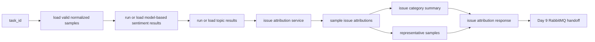
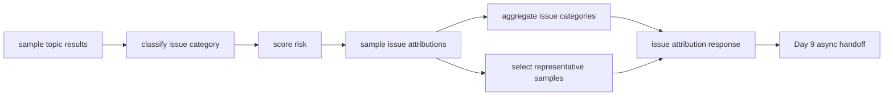

# Day 8：建立问题归因与代表样本整理主链

## 今天的总目标

- 把 Day 6 的情感结果和 Day 7 的关键词 / 主题结果，继续推进成业务可读的问题归因结果
- 先让模型归因到稳定的 `IssueCategory` code，不在代码里维护中文关键词规则
- 为每个问题类别整理代表样本，让结果不只是统计数字，而是能被业务人员快速复核
- 建立样本级问题归因、任务级问题分布、代表样本列表三层结果契约
- 为 Day 9 的 RabbitMQ 异步任务投递准备一条已经完整可执行的同步分析主链

## 今天结束前，你必须拿到什么

- 一条真正清楚的 `topic results + sentiment results -> issue attribution -> representative samples` 主链
- 一套 Day 8 最小问题归因 schema
- 一套 Day 8 最小问题归因 service 设计
- 一份能讲清楚“问题归因”和“主题归类”边界的说明
- 一份可以直接交给 Day 9 异步化改造的完整分析步骤
- 一份当前仓库里 Day 8 应该新增哪些文件、哪些文件只做小改的落点说明

---

## Day 8 一图总览

一句话总结：

> Day 8 不是再做一次主题分类，而是把已有情绪和内容结构整理成业务问题清单。

主链路先压缩成这一条：

```text
task
-> valid normalized samples
-> model-based sentiment results
-> keyword/topic results
-> issue attribution per sample
-> issue category summary
-> representative negative samples
-> Day 9 async task handoff
```

今天最不能混淆的 5 件事：

- Day 6 负责回答情绪倾向
- Day 6 的情绪倾向来自 Hugging Face 预训练模型，不再来自中文词表穷举
- Day 7 负责回答内容在讨论什么
- Day 8 负责回答这些内容可以归因到哪些业务问题
- 代表样本不是随便截取前几条，而是要优先挑负向、高风险、可解释样本
- Day 8 的终点是完整同步分析链，Day 9 才开始让 RabbitMQ 接管任务投递

---

## 为什么这一天重要

前面几天已经让 SentiFlow 有了：

- 可导入的数据集
- 可通过 CSV / JSON 原生解析或 MarkItDown 尝试解析进入系统的上传文件
- 可创建的分析任务
- 可复用的标准样本
- 基于预训练情感模型的情感分析结果
- 关键词与主题结构

但这些输出还不够业务可读。

业务人员真正想问的往往不是：

```text
负面占比是多少
高频关键词是什么
主题分布是什么
```

而是：

```text
主要问题在哪里
哪些问题最集中
哪些评论最值得人工看
这些问题应该先处理哪一类
```

所以 Day 8 的价值在于：

> 把技术分析结果收束成业务问题视角。

这一天完成后，SentiFlow 的核心分析链就从：

```text
输入文本
-> 导入抽取
-> 清洗
-> 模型情感判断
-> 主题
```

继续推进成：

```text
输入文本
-> 导入抽取
-> 清洗
-> 模型情感判断
-> 主题
-> 问题归因
-> 代表样本
```

这条链一旦完整，Day 9 再接 RabbitMQ 才有意义。  
因为队列应该接管的是一条已经讲清楚的分析链，而不是一堆还没有边界的零散分析函数。

---

## Day 8 整体架构



再压缩成仓库里真正的文件落点：

```text
router/tasks.py
-> services/preprocess_service.py
-> services/sentiment_service.py
-> services/topic_service.py
-> services/attribution_service.py
-> shcemas/attribution_schema.py
-> crud/task_crud.py
-> models/task_model.py
-> Day 9 再把触发方式改成队列投递
```

---

## 今天的边界要讲透

Day 8 解决的是：

```text
怎样复用 Day 6 的情感结果
怎样复用 Day 7 的关键词与主题结果
怎样给每条样本打上问题类别
怎样给问题类别做任务级统计
怎样筛出最值得人工看的代表样本
怎样给 Day 9 留出完整分析链入口
```

Day 8 不解决的是：

```text
RabbitMQ 怎样投递任务
worker 怎样消费任务
Redis 怎样追踪进度
PostgreSQL 怎样设计完整结果明细表
前端图表怎样展示
复杂图谱归因怎样实现
```

### 今天之后，各层职责应该怎么理解

| 位置 | Day 8 负责什么 | Day 8 不负责什么 |
| --- | --- | --- |
| `router/tasks.py` | 提供触发问题归因和返回结果的 HTTP 入口 | 写归因规则细节 |
| `services/preprocess_service.py` | 提供有效标准样本输入 | 判断业务问题类别 |
| `services/sentiment_service.py` | 通过预训练情感模型提供样本情感标签和分数 | 挑代表样本 |
| `services/topic_service.py` | 提供关键词、风险词和主题结果 | 直接生成问题归因结论 |
| `services/attribution_service.py` | 编排问题归因、问题统计、代表样本筛选 | 直接写 SQL 或处理上传文件 |
| `shcemas/attribution_schema.py` | 定义问题归因和代表样本结果契约 | 承担业务流程 |
| `crud/task_crud.py` | 后续可回写问题归因摘要 | 直接做归因规则 |
| `models/task_model.py` | 后续可留问题归因摘要字段 | 保存全部样本明细 |

### 对当前仓库的处理原则

Day 8 对现有目录先做三类判断：

| 分类 | 目录 / 文件 | 处理方式 |
| --- | --- | --- |
| 直接复用 | `services/preprocess_service.py` `services/sentiment_service.py` `services/topic_service.py` | 作为 Day 8 的输入来源 |
| 小改接入 | `router/tasks.py` `crud/task_crud.py` `models/task_model.py` | 先接最小入口和可选摘要回写 |
| 新增文件 | `services/attribution_service.py` `shcemas/attribution_schema.py` | 作为 Day 8 主线落点 |

这里要注意当前仓库目录名是 `shcemas/`，虽然拼写不是标准的 `schemas/`，但 Day 8 不建议顺手改目录名。  
今天要延续现有项目结构，先把问题归因主链立住。

---

## 今天开始，先不要急着接 RabbitMQ

Day 8 最容易犯的错误就是：

- 一看到 Day 9 要接 RabbitMQ，就今天先把队列写起来
- 一看到问题归因，就直接引入大模型、图谱或复杂检索
- 一看到代表样本，就简单返回前 5 条负面样本
- 一看到结果要持久化，就先设计一堆分析明细表

这些都不是 Day 8 的重点。

今天真正要解决的是：

> 已有情绪、关键词、主题结果，怎样稳定收束成业务问题归因和代表样本。

如果这个问题没讲清楚，  
Day 9 就算接了队列，也只是把混乱逻辑异步化。

所以 Day 8 的关键词不是“异步”，而是：

```text
归因
问题类别
代表样本
负向优先
风险优先
业务可读
同步主链完整
```

---

## 第 1 层：Day 8 的本质是什么

Day 1 定的是：

```text
边界
```

Day 2 定的是：

```text
任务流和信息架构
```

Day 3 定的是：

```text
后端应用骨架
```

Day 4 定的是：

```text
输入进入系统并挂到任务上
```

Day 5 定的是：

```text
原始文本怎样变成统一分析输入
```

Day 6 定的是：

```text
统一分析输入怎样通过预训练模型变成情感结果
```

Day 7 定的是：

```text
情感结果怎样继续变成内容结构结果
```

Day 8 定的是：

```text
内容结构结果怎样变成业务问题视角
```

也就是说，Day 8 不是继续扩大关键词和主题逻辑，  
而是开始回答一个更贴近业务的问题：

```text
这条评论到底在反映什么问题
这些问题在任务里分别有多少
哪些负面样本最能代表这些问题
```

这一步走通后，  
SentiFlow 的分析结果才从“模型输出”真正走向“业务结论”。

---

## 第 2 层：Day 8 的主链一定要从 Day 7 结果出发

今天你要先把 Day 8 的主链牢牢记成这样：

```text
sample topic results
-> issue attribution per sample
-> issue category summary
-> representative samples
```

这里最重要的不是步骤名字，  
而是你要看清楚：

- Day 8 接的是 Day 7 已经整理好的样本级主题结果
- Day 8 复用的是样本里的 `sentiment_label`、`keywords`、`risk_keywords`、`topic_label`
- Day 8 信任 Day 6 的模型情感结果，不再回退到中文词表规则
- 不是重新解析上传文件
- 不是重新做文本清洗
- 不是重新做主题归类
- 不是直接进入队列和 worker

### 为什么一定要从 Day 7 结果出发

因为 Day 7 已经做成了这条边界：

```text
normalized samples + sentiment results
-> sample keyword/topic results
-> task keyword/topic summary
```

那么 Day 8 最稳的接法就应该是：

```text
sample keyword/topic results
-> sample issue attribution
-> task issue summary
-> representative samples
```

而不是：

```text
raw text
-> 情绪判断
-> 主题判断
-> 问题归因
```

后者会把 Day 5、Day 6、Day 7、Day 8 的边界一起打乱。

---

## 第 3 层：为什么 Day 8 一定要同时保留问题统计和代表样本

很多人会本能地只做两种极端之一：

```text
只统计每类问题数量
```

或者：

```text
只返回几条负面评论
```

这两种都不够。

### 问题 1：只有问题统计，不够业务复核

如果只有：

- 物流问题 20 条
- 质量问题 15 条
- 服务问题 8 条

那业务人员看不到：

- 哪些评论支撑这个判断
- 为什么这些评论被归入这个问题
- 样本是否真的有代表性

### 问题 2：只有代表样本，不够整体判断

如果只有几条评论，  
结果页和报表页很难判断：

- 问题集中在哪类
- 哪些问题优先级最高
- 负向问题是否只是个例

### Day 8 最稳的做法

Day 8 一定要同时保留：

- `sample issue attribution`
- `issue category summary`
- `representative samples`

因为这三层分别服务不同问题：

- 样本级归因服务“这条为什么这么判”
- 类别统计服务“整体问题分布是什么”
- 代表样本服务“业务人员应该先看哪些证据”

---

## 第 4 层：Day 8 先把问题归因结果契约讲清楚

今天最值得先定住的，不是你到底用规则、模型还是检索来归因，  
而是 Day 8 产出的结果到底长什么样。

### 样本级问题归因至少应该有这些

```text
sample_id
content_clean
sentiment_label
topic_label
issue_category
issue_reason
risk_score
keywords
risk_keywords
```

### 代表样本至少应该有这些

```text
sample_id
content_clean
issue_category
sentiment_label
risk_score
reason
```

### 任务级问题摘要至少应该有这些

```text
task_id
category_distribution
negative_issue_count
top_issue_categories
representative_samples
```

### 为什么值得今天先保留 `issue_reason`

问题归因如果没有解释，  
很快就会变成一组很难复核的标签。

哪怕今天只是让模型做最小归因，也应该留下极简原因：

- 模型判断该样本主要属于 logistics
- 模型判断该样本主要属于 quality
- 模型无法归入更具体类别，先归入 general

这不是为了让归因一次完美，  
而是为了让业务人员能理解系统为什么这么归类。

### 为什么值得今天先保留 `risk_score`

代表样本需要排序依据。  
如果没有 `risk_score`，你只能随机取样或取前几条。

Day 8 的最小 `risk_score` 可以很简单：

- 负向情感加分
- 命中风险词加分
- 命中明确问题主题加分
- 文本长度适中加分

它的目标不是精确建模，  
而是让代表样本筛选有稳定、可解释的排序基础。

---

## 第 5 层：Day 8 最小问题归因步骤应该先有哪些

Day 8 最稳的做法，不是一次引入复杂归因系统。  
而是先把最小、最可解释、最可验证的步骤立住。

### 步骤 1：读取 Day 7 样本级结果

至少要确保每条样本有：

- `sample_id`
- `content_clean`
- `sentiment_label`
- `keywords`
- `risk_keywords`
- `topic_label`

### 步骤 2：调用模型判断问题类别

输出仍然使用稳定的英文 code，避免在代码里维护中文关键词规则：

```text
logistics
quality
price
service
feature
general
```

### 步骤 3：给出极简归因原因

每条样本至少应该能说清楚：

- 模型参考了哪个 Day 7 主题
- 最终归入了哪个稳定问题类别
- 如果没有明确类别，为什么先归入 general

### 步骤 4：计算风险分

最小风险分先可以基于：

- 情感标签
- 风险词数量
- 问题类别
- 文本可读性

### 步骤 5：聚合任务级问题分布

至少统计：

- 各问题类别数量
- 负向问题数量
- 高频问题类别

### 步骤 6：筛选代表样本

至少遵循：

- 优先负向样本
- 优先命中风险词样本
- 优先风险分高的样本
- 尽量覆盖不同问题类别

### 步骤 7：结果回写或返回

当前 Day 8 可以先把结果作为接口响应返回。  
如果要可查询、可复盘，再把摘要回写到任务层。

---

## 第 6 层：结合当前仓库，Day 8 最小落点应该放在哪

基于当前项目实际目录，  
Day 8 最稳的做法不是一下子引入完整结果存储层，  
而是在已有分析主链上补一条独立的问题归因主线：

```text
router/tasks.py
services/preprocess_service.py
services/sentiment_service.py
services/topic_service.py
services/attribution_service.py
shcemas/attribution_schema.py
crud/task_crud.py
models/task_model.py
```

### `router/tasks.py`

负责：

- 提供触发 Day 8 问题归因的入口
- 串联已有预处理、情感分析、主题分析结果
- 返回问题分布和代表样本

### `services/preprocess_service.py`

负责：

- 提供有效标准样本读取能力

当前仓库里 `router/tasks.py` 已经调用了 `preprocess_service.get_valid_samples(...)`，  
但 `services/preprocess_service.py` 里还需要真正补出这个方法。  
Day 8 的计划里要记住这件事，但不要把预处理逻辑写进归因层。

### `services/sentiment_service.py`

负责：

- 提供样本级情感标签
- 给代表样本筛选提供负向优先依据

### `services/topic_service.py`

负责：

- 提供样本级关键词、风险词和主题结果

### `services/attribution_service.py`

负责：

- 判断样本问题类别
- 计算风险分
- 聚合问题类别统计
- 筛选代表样本
- 组装 Day 8 统一响应

### `shcemas/attribution_schema.py`

负责：

- 定义样本级问题归因结果
- 定义代表样本结构
- 定义任务级问题摘要
- 定义问题归因响应

### `crud/task_crud.py`

负责：

- 后续可新增问题归因摘要回写方法
- 今天可以先把回写作为可选增强

### `models/task_model.py`

负责：

- 后续可新增问题归因摘要字段
- 今天不建议先把所有分析明细都塞进任务表

---

## 第 7 层：Day 8 最小接口建议长什么样

今天最关键的接口建议先有这两个：

- `POST /tasks/{task_id}/issues`
- `GET /tasks/{task_id}/issues`

### `POST /tasks/{task_id}/issues`

它的职责是：

- 读取当前任务关联的数据集
- 获取有效标准样本
- 复用基于预训练模型的情感分析和主题分析主链
- 执行 Day 8 的问题归因与代表样本整理
- 返回问题分布、代表样本和样本归因预览

它不负责：

- 直接投递 RabbitMQ
- 直接启动 worker
- 直接生成报表
- 直接写前端展示逻辑

### `GET /tasks/{task_id}/issues`

它的职责是：

- 查询当前任务是否已有问题归因摘要
- 返回问题分布和代表样本

在当前仓库还没有完整结果持久化前，  
这个接口可以先作为 Day 12 之后的查询目标，不一定今天强行写满。

---

## 第 8 层：Day 8 不建议做什么

### 不要今天就把 RabbitMQ 接进来

Day 9 会专门处理：

- 队列连接
- 消息结构
- 任务投递
- 任务状态变更

Day 8 只需要确保同步分析链已经完整。

### 不要把问题归因塞进 `topic_service.py`

Day 7 的 `topic_service.py` 重点是：

- 关键词
- 风险词
- 主题
- 内容结构

Day 8 如果继续把问题归因塞进去，  
这个 service 会变成“主题层 + 业务归因层”的混合层。

### 不要只返回几条负面样本

如果 Day 8 只返回：

```text
负面评论 1
负面评论 2
负面评论 3
```

那后面很难稳定支持：

- 问题类别分布
- 类别优先级
- 报表展示
- 业务复核

### 不要今天就引入复杂图谱归因

目标文档里确实提到 Neo4j 和 GraphRAG，  
但那是后续演进能力，不属于 Day 8 的 MVP 主线。

今天先做：

- 规则可解释归因
- 最小类别统计
- 代表样本筛选

### 不要今天就设计完整分析结果表

Day 12 会专门收敛 PostgreSQL 结果持久化。  
Day 8 可以先把 schema 和响应结构定稳，最多给任务表留摘要字段建议。

---

## 上午学习：09:00 - 12:00

## 09:00 - 09:50：把 Day 8 的主问题讲顺

### 今天你要能顺着说出来

```text
Day 5 已经把原始文本变成标准样本
-> Day 6 已经把标准样本通过 Hugging Face 情感模型变成情感结果
-> Day 7 已经把样本变成关键词和主题结果
-> Day 8 不再重复做情绪和主题
-> Day 8 要把已有结果归因成业务问题类别
-> 再筛出最值得人工看的代表样本
-> Day 9 再把这条完整分析链放进 RabbitMQ 投递模型
```

### 你必须能回答这两个问题

1. 为什么 Day 8 的起点必须是 Day 7 的样本级主题结果，而不是重新处理原始文本？
2. 为什么 Day 8 一定要同时保留问题统计和代表样本？

---

## 09:50 - 10:40：先画 Day 8 的主链图

### Day 8 问题归因主链



### 这张图要表达什么

系统真正围绕的是：

- 样本级主题结果
- 样本级问题归因
- 任务级问题分布
- 代表样本

而不是“多加一个问题标签”这么局部的动作。

---

## 10:40 - 11:30：先整理 Day 8 的结果契约

### `steps/day8_attribution_contract.md` 练手骨架版

````markdown
# Day 8 问题归因结果契约

## 样本级问题归因最小结构

- TODO

## 任务级问题摘要最小结构

- TODO

## 代表样本最小结构

- TODO

## Day 9 会消费什么

- TODO
````

### `steps/day8_attribution_contract.md` 参考答案

````markdown
# Day 8 问题归因结果契约

## 样本级问题归因最小结构

- `sample_id`
- `content_clean`
- `sentiment_label`
- `topic_label`
- `issue_category`
- `issue_reason`
- `risk_score`
- `keywords`
- `risk_keywords`

## 任务级问题摘要最小结构

- `task_id`
- `category_distribution`
- `negative_issue_count`
- `top_issue_categories`

## 代表样本最小结构

- `sample_id`
- `content_clean`
- `issue_category`
- `sentiment_label`
- `risk_score`
- `reason`

## Day 9 会消费什么

- 一条已经完整的同步分析链
- 可被队列消息触发的 `task_id`
- 可被 worker 调用的问题归因 service
- 可回写的问题摘要和代表样本结果
````

### 这一段你一定要看懂

Day 8 真正要统一的不是“归因规则多聪明”，  
而是后面异步执行、结果页、报表页看到的问题归因结果契约。

---

## 11:30 - 12:00：先决定今天怎么验收

### Day 8 最直接的验收方式

今天至少要能回答：

1. Day 8 的输入到底是什么？
2. Day 8 的输出到底是什么？
3. 为什么问题归因不能塞进主题归类里？
4. 为什么代表样本必须有排序依据？
5. Day 9 为什么可以直接接 Day 8 的完整同步主链？

---

## 下午编码：14:00 - 18:00

## 14:00 - 14:40：先补 `shcemas/attribution_schema.py`

建议先补：

- `IssueCategory`
- `SampleIssueAttribution`
- `RepresentativeSample`
- `IssueCategorySummary`
- `IssueAttributionResponse`

### `shcemas/attribution_schema.py` 练手骨架版

```python
from enum import Enum

from pydantic import BaseModel, Field

from shcemas.sentiment_schema import SentimentLabel


class IssueCategory(str, Enum):
    # 你要做的事：
    # 1. 定义 Day 8 最小问题类别
    # 2. 保持枚举值稳定，方便后续统计和展示
    # 3. 不要今天就扩成过细的业务标签树
    raise NotImplementedError


class SampleIssueAttribution(BaseModel):
    # 你要做的事：
    # 1. 定义样本引用和文本
    # 2. 保留情感、主题、关键词上下文
    # 3. 定义问题类别、归因原因和风险分
    raise NotImplementedError


class RepresentativeSample(BaseModel):
    # 你要做的事：
    # 1. 定义代表样本需要展示的最小字段
    # 2. 保留问题类别、情感和风险分
    # 3. 保留一条可读原因
    raise NotImplementedError


class IssueCategorySummary(BaseModel):
    # 你要做的事：
    # 1. 定义任务级问题分布
    # 2. 定义负向问题数量
    # 3. 定义高频问题类别
    raise NotImplementedError


class IssueAttributionResponse(BaseModel):
    # 你要做的事：
    # 1. 定义 task_id
    # 2. 组合任务级摘要
    # 3. 返回代表样本和样本级预览
    raise NotImplementedError
```

### `shcemas/attribution_schema.py` 参考答案

```python
from enum import Enum

from pydantic import BaseModel, Field

from shcemas.sentiment_schema import SentimentLabel


class IssueCategory(str, Enum):
    logistics = "logistics"
    quality = "quality"
    price = "price"
    service = "service"
    feature = "feature"
    general = "general"


class SampleIssueAttribution(BaseModel):
    sample_id: str
    content_clean: str
    sentiment_label: SentimentLabel
    topic_label: str
    issue_category: IssueCategory
    issue_reason: str
    risk_score: int = 0
    keywords: list[str] = Field(default_factory=list)
    risk_keywords: list[str] = Field(default_factory=list)


class RepresentativeSample(BaseModel):
    sample_id: str
    content_clean: str
    issue_category: IssueCategory
    sentiment_label: SentimentLabel
    risk_score: int
    reason: str


class IssueCategorySummary(BaseModel):
    task_id: str
    category_distribution: dict[IssueCategory, int] = Field(default_factory=dict)
    negative_issue_count: int = 0
    top_issue_categories: list[IssueCategory] = Field(default_factory=list)


class IssueAttributionResponse(BaseModel):
    task_id: str
    summary: IssueCategorySummary
    representative_samples: list[RepresentativeSample] = Field(default_factory=list)
    preview_results: list[SampleIssueAttribution] = Field(default_factory=list)
```

### 这里要先理解的点

Day 8 的 schema 不是为了把归因做复杂，  
而是为了把“问题类别、问题证据、代表样本”这层结果稳定下来。

---

## 14:40 - 15:20：先确认 Day 7 的输出能被 Day 8 消费

Day 8 真正落地前，最值得先确认的一步，是它能稳定拿到：

- `SampleTopicResult`
- `sentiment_label`
- 这个 `sentiment_label` 来自 Day 6 的情感模型输出，而不是 Day 8 自己重新判定
- `keywords`
- `risk_keywords`
- `topic_label`

### `services/topic_service.py` 今天应该提供的输入形状

```python
def run_topic_analysis(...):
    ...
    return TopicAnalysisResponse(
        task_id=task_id,
        keyword_summary=keyword_summary,
        topic_summary=topic_summary,
        preview_results=results[:5],
    )
```

### 为什么这一步值得今天先确认

因为 Day 8 真正要消费的不是：

- 原始文本
- 单独一份任务级主题摘要

而是：

- 样本级主题结果集合

如果 Day 8 只能拿到前 5 条 `preview_results`，  
那代表样本和问题统计会被预览数量限制。  
所以正式实现时要注意：预览可以只返回 5 条，但 service 内部归因应该基于完整样本级结果。

---

## 15:20 - 16:30：在 `services/attribution_service.py` 里立住主链

建议先补：

- `classify_issue(...)`
- `analyze_issue(...)`
- `_build_headers(...)`
- `_chat_completions_url(...)`
- `_parse_model_json(...)`
- `score_risk(...)`
- `build_sample_attributions(...)`
- `build_category_summary(...)`
- `select_representative_samples(...)`
- `run_issue_attribution(...)`

### `services/attribution_service.py` 练手骨架版

```python
from collections import Counter
from typing import Any

from shcemas.attribution_schema import (
    IssueAttributionResponse,
    IssueCategory,
    IssueCategorySummary,
    RepresentativeSample,
    SampleIssueAttribution,
)
from shcemas.sentiment_schema import SentimentLabel
from shcemas.topic_schema import SampleTopicResult


class AttributionService:
    def classify_issue(self, item: SampleTopicResult) -> tuple[IssueCategory, str]:
        # 你要做的事：
        # 1. 调用 analyze_issue 得到模型归因结果
        # 2. 返回稳定 IssueCategory 和一条可读原因
        # 3. 不要在这里重复做关键词或文本规则判断
        raise NotImplementedError

    def analyze_issue(self, item: SampleTopicResult) -> dict[str, Any]:
        # 你要做的事：
        # 1. 调用 OpenAI 兼容的 chat completions 接口
        # 2. 要求模型只返回 JSON
        # 3. JSON 中必须包含 issue_category、issue_reason
        # 4. issue_category 使用稳定英文 code
        raise NotImplementedError

    def _chat_completions_url(self) -> str:
        # 你要做的事：
        # 1. 读取配置中的 LLM_BASE_URL
        # 2. 兼容已经以 /chat/completions 结尾的地址
        # 3. 返回最终请求地址
        raise NotImplementedError

    def _build_headers(self) -> dict[str, str]:
        # 你要做的事：
        # 1. 设置 JSON 请求头
        # 2. 如果配置了 DASHSCOPE_API_KEY，就补 Authorization
        raise NotImplementedError

    def _parse_model_json(self, content: str) -> dict[str, Any]:
        # 你要做的事：
        # 1. 解析模型返回的 JSON
        # 2. 把 issue_category 规整成 IssueCategory
        # 3. 模型返回未知类别时归为 general
        raise NotImplementedError

    def score_risk(self, item: SampleTopicResult, category: IssueCategory) -> int:
        # 你要做的事：
        # 1. 负向情绪增加风险分
        # 2. 风险词越多，分数越高
        # 3. 明确问题类别比通用反馈更高
        # 4. 分数保持简单可解释
        raise NotImplementedError

    def build_sample_attributions(
        self,
        topic_results: list[SampleTopicResult],
    ) -> list[SampleIssueAttribution]:
        # 你要做的事：
        # 1. 遍历样本级主题结果
        # 2. 调用 classify_issue 得到问题类别
        # 3. 调用 score_risk 得到风险分
        # 4. 组装样本级问题归因结果
        raise NotImplementedError

    def build_category_summary(
        self,
        task_id: str,
        attributions: list[SampleIssueAttribution],
    ) -> IssueCategorySummary:
        # 你要做的事：
        # 1. 统计每个问题类别数量
        # 2. 统计负向问题样本数量
        # 3. 取高频问题类别
        # 4. 组装任务级摘要
        raise NotImplementedError

    def select_representative_samples(
        self,
        attributions: list[SampleIssueAttribution],
        limit: int = 5,
    ) -> list[RepresentativeSample]:
        # 你要做的事：
        # 1. 优先选择负向样本
        # 2. 按风险分倒序
        # 3. 尽量保留不同问题类别
        # 4. 组装代表样本列表
        raise NotImplementedError

    def run_issue_attribution(
        self,
        task_id: str,
        topic_results: list[SampleTopicResult],
    ) -> IssueAttributionResponse:
        # 你要做的事：
        # 1. 先生成样本级问题归因
        # 2. 再生成任务级问题摘要
        # 3. 再筛选代表样本
        # 4. 最后组装统一响应
        raise NotImplementedError
```

### `services/attribution_service.py` 参考答案

```python
from collections import Counter
import json
from typing import Any

import httpx

from conf.settings import settings
from shcemas.attribution_schema import (
    IssueAttributionResponse,
    IssueCategory,
    IssueCategorySummary,
    RepresentativeSample,
    SampleIssueAttribution,
)
from shcemas.sentiment_schema import SentimentLabel
from shcemas.topic_schema import SampleTopicResult


class AttributionService:
    category_values = tuple(category.value for category in IssueCategory)

    def classify_issue(self, item: SampleTopicResult) -> tuple[IssueCategory, str]:
        analysis = self.analyze_issue(item)
        return analysis["issue_category"], analysis["issue_reason"]

    def analyze_issue(self, item: SampleTopicResult) -> dict[str, Any]:
        if not settings.LLM_BASE_URL or not settings.LLM_MODEL_NAME:
            raise RuntimeError("缺少 LLM_BASE_URL 或 LLM_MODEL_NAME，无法执行问题归因")

        response = httpx.post(
            self._chat_completions_url(),
            headers=self._build_headers(),
            json={
                "model": settings.LLM_MODEL_NAME,
                "messages": [
                    {
                        "role": "system",
                        "content": (
                            "你是舆情分析助手。请只输出 JSON，不要输出 Markdown。"
                            "JSON 字段必须包含 issue_category、issue_reason。"
                            "issue_category 必须是以下英文 code 之一："
                            f"{', '.join(self.category_values)}。"
                            "这些 code 是稳定业务分类，不要按固定中文关键词命中规则判断。"
                            "issue_reason 用一句中文说明归因依据，不要只复述原评论。"
                        ),
                    },
                    {
                        "role": "user",
                        "content": (
                            "根据评论内容、情感标签和 Day 7 内容结构结果，判断最合适的问题类别。\n"
                            f"评论：{item.content_clean}\n"
                            f"情感：{item.sentiment_label.value}\n"
                            f"Day 7 主题：{item.topic_label}\n"
                            f"关键词：{item.keywords}\n"
                            f"风险词：{item.risk_keywords}"
                        ),
                    },
                ],
                "temperature": 0,
            },
            timeout=settings.LLM_TIMEOUT_SECONDS,
        )
        response.raise_for_status()
        content = response.json()["choices"][0]["message"]["content"]
        return self._parse_model_json(content)

    @staticmethod
    def _chat_completions_url() -> str:
        base_url = settings.LLM_BASE_URL.rstrip("/")
        if base_url.endswith("/chat/completions"):
            return base_url
        return f"{base_url}/chat/completions"

    def _build_headers(self) -> dict[str, str]:
        headers = {"Content-Type": "application/json"}
        if settings.DASHSCOPE_API_KEY:
            headers["Authorization"] = f"Bearer {settings.DASHSCOPE_API_KEY}"
        return headers

    @staticmethod
    def _parse_model_json(content: str) -> dict[str, Any]:
        content = content.strip()
        if content.startswith("```"):
            content = content.strip("`")
            if content.lower().startswith("json"):
                content = content[4:].strip()

        payload = json.loads(content)
        raw_category = str(payload.get("issue_category") or IssueCategory.general.value).strip()
        try:
            issue_category = IssueCategory(raw_category)
        except ValueError:
            issue_category = IssueCategory.general

        return {
            "issue_category": issue_category,
            "issue_reason": str(payload.get("issue_reason") or "模型未返回明确归因原因"),
        }

    def score_risk(self, item: SampleTopicResult, category: IssueCategory) -> int:
        score = 0
        if item.sentiment_label == SentimentLabel.negative:
            score += 50
        if item.risk_keywords:
            score += min(len(item.risk_keywords) * 15, 30)
        if category != IssueCategory.general:
            score += 15
        if 8 <= len(item.content_clean) <= 120:
            score += 5
        return min(score, 100)

    def build_sample_attributions(
        self,
        topic_results: list[SampleTopicResult],
    ) -> list[SampleIssueAttribution]:
        results = []
        for item in topic_results:
            category, reason = self.classify_issue(item)
            risk_score = self.score_risk(item, category)
            results.append(
                SampleIssueAttribution(
                    sample_id=item.sample_id,
                    content_clean=item.content_clean,
                    sentiment_label=item.sentiment_label,
                    topic_label=item.topic_label,
                    issue_category=category,
                    issue_reason=reason,
                    risk_score=risk_score,
                    keywords=item.keywords,
                    risk_keywords=item.risk_keywords,
                )
            )
        return results

    def build_category_summary(
        self,
        task_id: str,
        attributions: list[SampleIssueAttribution],
    ) -> IssueCategorySummary:
        counter = Counter(item.issue_category for item in attributions)
        negative_issue_count = sum(
            1 for item in attributions if item.sentiment_label == SentimentLabel.negative
        )
        top_issue_categories = [category for category, _ in counter.most_common(5)]
        return IssueCategorySummary(
            task_id=task_id,
            category_distribution=dict(counter),
            negative_issue_count=negative_issue_count,
            top_issue_categories=top_issue_categories,
        )

    def select_representative_samples(
        self,
        attributions: list[SampleIssueAttribution],
        limit: int = 5,
    ) -> list[RepresentativeSample]:
        sorted_items = sorted(
            attributions,
            key=lambda item: (
                item.sentiment_label == SentimentLabel.negative,
                item.risk_score,
                len(item.risk_keywords),
            ),
            reverse=True,
        )

        selected = []
        used_categories = set()
        for item in sorted_items:
            if len(selected) >= limit:
                break
            if item.issue_category in used_categories and len(used_categories) < limit:
                continue
            used_categories.add(item.issue_category)
            selected.append(
                RepresentativeSample(
                    sample_id=item.sample_id,
                    content_clean=item.content_clean,
                    issue_category=item.issue_category,
                    sentiment_label=item.sentiment_label,
                    risk_score=item.risk_score,
                    reason=item.issue_reason,
                )
            )

        if len(selected) < limit:
            selected_ids = {item.sample_id for item in selected}
            for item in sorted_items:
                if len(selected) >= limit:
                    break
                if item.sample_id in selected_ids:
                    continue
                selected.append(
                    RepresentativeSample(
                        sample_id=item.sample_id,
                        content_clean=item.content_clean,
                        issue_category=item.issue_category,
                        sentiment_label=item.sentiment_label,
                        risk_score=item.risk_score,
                        reason=item.issue_reason,
                    )
                )
        return selected

    def run_issue_attribution(
        self,
        task_id: str,
        topic_results: list[SampleTopicResult],
    ) -> IssueAttributionResponse:
        attributions = self.build_sample_attributions(topic_results)
        summary = self.build_category_summary(task_id=task_id, attributions=attributions)
        representative_samples = self.select_representative_samples(attributions)
        return IssueAttributionResponse(
            task_id=task_id,
            summary=summary,
            representative_samples=representative_samples,
            preview_results=attributions[:5],
        )


attribution_service = AttributionService()
```

### 这里要先理解的点

1. Day 8 的核心是把“内容结构结果”变成“业务问题结果”  
2. 今天用 LLM 把 Day 7 的内容结构结果归因为稳定 `IssueCategory` code，是为了避免重复做关键词和文本规则判断  
3. 后面即使替换更强模型、图谱或检索增强，`SampleIssueAttribution` 和 `IssueAttributionResponse` 仍然应该稳定  
4. 代表样本不是纯展示字段，它是业务复核入口  
5. Day 9 要接管的是 `run_issue_attribution(...)` 所在的完整分析链，而不是重新设计归因逻辑  

---

## 16:30 - 17:10：给 `crud/task_crud.py` 和 `models/task_model.py` 留出 Day 8 落点

如果 Day 8 要可查询、可复盘，  
那 `task` 至少应该能承接一些问题归因摘要事实。

### `models/task_model.py` 建议新增的字段

```python
issue_status: Mapped[str | None]
issue_summary: Mapped[str | None]
top_issue_categories: Mapped[str | None]
representative_samples: Mapped[str | None]
```

### `crud/task_crud.py` 建议新增的方法

```python
async def update_task_issue_summary(
    session: AsyncSession,
    task_id: str,
    issue_status: str,
    issue_summary: str,
    top_issue_categories: str,
    representative_samples: str,
) -> Task | None:
    ...
```

### 为什么 Day 8 可以先把回写做轻

当前项目还没到 Day 12 的完整结果持久化阶段。  
所以今天可以先选择：

- 接口直接返回完整响应
- 任务表只留摘要字段建议
- 详细样本归因后续再单独落结果表

这样不会把 Day 8 做成数据库设计日。

---

## 17:10 - 17:45：把 `router/tasks.py` 的问题归因入口补出来

### `router/tasks.py` 练手骨架版

```python
@router.post("/{task_id}/issues")
async def run_task_issue_attribution(task_id: str, db=Depends(get_db)):
    # 你要做的事：
    # 1. 查询 task，不存在就返回统一错误
    # 2. 查询 dataset，不存在就返回统一错误
    # 3. 获取有效标准样本
    # 4. 复用情感分析和主题分析结果
    # 5. 调用 attribution_service
    # 6. 返回统一成功响应
    raise NotImplementedError
```

### `router/tasks.py` 参考答案

```python
from crud.dataset_crud import get_dataset_by_id
from crud.task_crud import get_task_detail
from services.attribution_service import attribution_service
from services.preprocess_service import preprocess_service
from services.sentiment_service import sentiment_service
from services.topic_service import topic_service
from utils.response import error_response, success_response


@router.post("/{task_id}/issues")
async def run_task_issue_attribution(task_id: str, db=Depends(get_db)):
    task = await get_task_detail(session=db, task_id=task_id)
    if task is None:
        return error_response(message="task not found", code=1, data=None)

    dataset = await get_dataset_by_id(session=db, dataset_id=task.dataset_id)
    if dataset is None:
        return error_response(message="dataset not found", code=1, data=None)

    samples = preprocess_service.get_valid_samples(dataset=dataset)
    sentiment_response = sentiment_service.run_sentiment(task_id=task_id, samples=samples)
    sentiment_map = {
        item.sample_id: item
        for item in sentiment_response.preview_results
    }
    topic_response = topic_service.run_topic_analysis(
        task_id=task_id,
        samples=samples,
        sentiment_map=sentiment_map,
    )
    response = attribution_service.run_issue_attribution(
        task_id=task_id,
        topic_results=topic_response.preview_results,
    )
    return success_response(data=response.model_dump(), message="issue attribution completed")
```

### 为什么 router 层今天仍然一定要克制

因为 Day 8 的 router 还是只应该做：

- 查 task
- 查 dataset
- 拿有效标准样本
- 拿情感结果
- 拿主题结果
- 调归因 service
- 返回统一响应

如果今天就在 router 里写问题类别判断，  
Day 9 把逻辑搬进 worker 时会非常难拆。

---

## 17:45 - 18:00：整理 Day 9 的输入

Day 9 会开始进入：

- RabbitMQ 连接配置
- 消息结构设计
- 创建任务后投递消息
- 任务状态从同步返回转向 queued

所以 Day 8 结束前，  
你至少要准备好这些输入：

- 一条完整的同步分析链
- 一个可以代表任务的 `task_id`
- 一个可以被 worker 调用的归因 service
- 一套问题归因响应契约
- 一套代表样本结果契约

这样 Day 9 才不用一边接队列，一边补业务分析逻辑。

---

## 晚上复盘：20:00 - 21:00

### 今晚你必须自己讲顺的 8 个点

1. Day 8 的本质为什么是“业务问题视角落地”，不是“继续做主题分类”？  
2. 为什么 Day 8 必须从 Day 7 的样本级主题结果出发？  
3. 为什么问题归因一定要同时保留样本级结果和任务级摘要？  
4. 为什么代表样本不能只是前几条负面评论？  
5. 为什么 `attribution_service.py` 不该塞回 `topic_service.py`？  
6. 为什么 Day 8 要先保留 `issue_reason` 和 `risk_score`？  
7. 为什么 Day 9 接 RabbitMQ 前，必须先有完整同步分析链？  
8. 今天的问题归因结果怎样支撑后续结果页、报表和导出？  

---

## 今日验收标准

- `steps/day8.md` 对 Day 8 的目标、边界和文件落点讲清楚
- Day 8 的输入输出契约讲清楚
- 样本级问题归因、任务级问题摘要、代表样本的最小结构讲清楚
- 问题归因主链的最小步骤讲清楚
- `services/attribution_service.py` 的职责讲清楚
- `shcemas/attribution_schema.py` 的最小设计讲清楚
- `router/tasks.py` 的问题归因入口讲清楚
- Day 9 的 RabbitMQ 异步任务投递输入已经准备好

---

## 今天最容易踩的坑

### 坑 1：把 Day 8 当成 Day 7 的附属步骤

问题：

- 问题归因逻辑继续塞在主题层
- 主题归类和业务归因边界混掉

规避建议：

- Day 7 到 `topic results`
- Day 8 从 `topic results` 开始进入问题归因

### 坑 2：只做问题类别统计，不保留样本证据

问题：

- 看不到具体评论如何支撑问题类别
- 业务人员无法复核结果

规避建议：

- 保留 `SampleIssueAttribution`
- 保留 `RepresentativeSample`

### 坑 3：只筛代表样本，不做任务级摘要

问题：

- 结果页和报表页没有稳定统计口径
- 后续导出和展示都不好接

规避建议：

- 保留 `IssueCategorySummary`
- 保留 `category_distribution`
- 保留 `top_issue_categories`

### 坑 4：今天就把 Day 9 内容提前混进来

问题：

- 队列、状态、worker、归因逻辑一起写
- Day 8 主链边界失焦

规避建议：

- Day 8 只先跑通同步问题归因主链
- Day 9 再专门处理 RabbitMQ 投递

### 坑 5：代表样本没有排序依据

问题：

- 返回样本不可解释
- 每次结果可能不稳定

规避建议：

- 先保留 `risk_score`
- 先按负向、风险词、明确问题类别排序

### 坑 6：今天又在 Day 8 重写一套关键词归因规则

问题：

- Day 7 已经做过主题和关键词判断，Day 8 又重新判断一遍
- 同一条样本可能在 Day 7 和 Day 8 得到不一致结果
- 后面维护两套规则，边界越来越乱

规避建议：

- Day 8 只把 Day 7 的内容结构结果作为模型输入
- `risk_keywords` 只用于模型上下文、风险分和代表样本排序
- 后续要增强时替换归因模型或补检索上下文，不要叠加一套关键词命中规则

---

## 给明天的交接提示

明天开始，SentiFlow 就不只是“同步接口里跑完整分析链”，  
而是要开始真正回答另一个工程问题：

```text
批量分析任务怎样从 HTTP 请求中解耦出来
```

也就是说，后面会继续走向：

```text
create task
-> enqueue RabbitMQ message
-> worker consumes task
-> run preprocess
-> run sentiment
-> run topics
-> run issue attribution
-> write result and status
```

所以 Day 8 最关键的交接只有一句话：

```text
先把标准样本稳定推进到情感、主题、问题归因和代表样本的完整同步分析链，Day 9 的 RabbitMQ 才是在接管一条清楚的任务链，而不是替混乱逻辑换一种执行方式。
```
